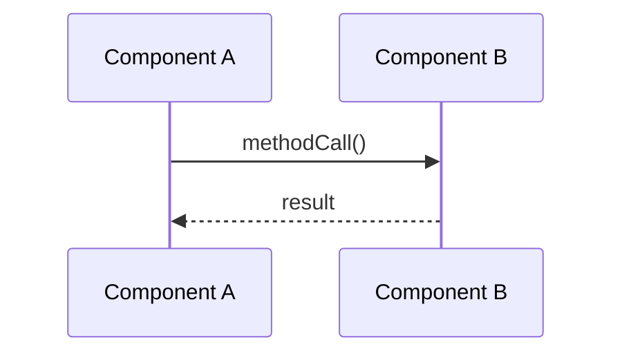

# Documentation Updater Skill

Automatically update project documentation after any code change that affects module connections, adds new files, or changes method signatures.

## When to Apply This Skill

1. **New file added** - Update parent README.md "Key Components" section
2. **Method signature changed** - Update "Key Methods" in relevant README
3. **New cross-module call added** - Update CONNECTIONS.md + both module READMEs
4. **Sync adapter added** - Update ProfileSyncManager section + create adapter entry
5. **Event kind added** - Update NOSTR_EVENTS.md + RideshareEventKinds reference
6. **Code deleted** - Remove stale references from all documentation

## Documentation Files to Update

| File | Location | When to Update |
|------|----------|----------------|
| Common README | `common/src/main/README.md` | New shared code (payment, nostr, sync, data, routing, ui) |
| Rider README | `rider-app/src/main/README.md` | New rider app code (ViewModel, screens, services) |
| Driver README | `drivestr/src/main/README.md` | New driver app code (ViewModel, screens, services) |
| CONNECTIONS.md | `docs/CONNECTIONS.md` | New cross-module connections, architectural changes |
| NOSTR_EVENTS.md | `docs/protocol/NOSTR_EVENTS.md` | New event kinds |
| CLAUDE.md | `.claude/CLAUDE.md` | Major architectural changes |
| **Master Plan** | `~/.claude/plans/master plan.md` | Feature completion, implementation learnings, verification checklists |
| Skill-specific plans | `~/.claude/plans/*.md` | When completing features tracked by a specific plan |

## Checklist After Code Changes

### For New Files
- [ ] Add to parent module's README.md "Key Components" table
- [ ] Add any cross-module connections to CONNECTIONS.md
- [ ] Update mermaid diagrams if architectural change
- [ ] Add to relevant skill file if it's a common pattern

### For Modified Methods
- [ ] Check if method is listed in any README - update if signature changed
- [ ] Check if method is in a connection example - update if renamed
- [ ] Update line number references if they've changed significantly

### For New Connections
- [ ] Add row to source module's README.md "Connections Table"
- [ ] Add row to target module's README.md "Connections Table" (reverse direction)
- [ ] Add to CONNECTIONS.md bullet hierarchy under appropriate section
- [ ] Update mermaid diagram if it's a significant new connection

### For Deleted Code
- [ ] Remove from README.md "Key Components"
- [ ] Remove from "Connections Table" (both ends)
- [ ] Remove from CONNECTIONS.md bullet hierarchy
- [ ] Check for stale references in mermaid diagrams
- [ ] Remove from skill files if referenced there

### For Feature Completion (IMPORTANT)
- [ ] Update `~/.claude/plans/master plan.md` with:
  - Implementation status change (MISSING → COMPLETE)
  - Key learnings and gotchas discovered
  - New file/method references with line numbers
  - Updated verification checklist
- [ ] Update any feature-specific plan file in `~/.claude/plans/`
- [ ] Update relevant skill files (e.g., `cashu-wallet/SKILL.md` for payment features)

## Plan File Updates

**Location**: `C:\Users\Iwill\.claude\plans\`

### When to Update Plans

| Trigger | What to Update |
|---------|----------------|
| Feature marked complete | Status, verification checklist, file references |
| Bug fix with learnings | "Key Learnings" section with root cause + fix |
| New method added for feature | "File Reference" table with line numbers |
| Architectural decision made | Document reasoning in relevant section |
| Gotcha discovered | Add to "Common Issues" or "Key Learnings" |

### Master Plan Structure
```markdown
# Feature Name - Implementation Status

**Status**: ✅ COMPLETE / 🚧 IN PROGRESS / ❌ BLOCKED

## Implementation Summary
- Key components implemented
- Important design decisions

## Key Learnings
- Problem discovered → Solution applied

## File Reference
| File | Key Changes |
|------|-------------|
| `File.kt:123` | What was added/changed |

## Verification Checklist
- [x] Completed items
- [ ] Pending items
```

## Documentation Formats

### README.md Key Components Table
```markdown
| File | Purpose | Key Methods |
|------|---------|-------------|
| `NewFile.kt` | Brief purpose | `method1()`, `method2()` |
```

### README.md Connections Table
```markdown
| From (this module) | To (other module) | How/Why | Example Call |
|--------------------|-------------------|---------|--------------|
| `ClassName` | `OtherClass` | Brief purpose | `instance.method()` |
```

### CONNECTIONS.md Bullet Hierarchy
```
Parent Component
├── Child Component
│   ├── Depends on: X (reason)
│   ├── Connects to: Y (protocol)
│   └── Used by: Z
```

### Mermaid Sequence Diagram


## Verification Steps

After updating documentation:

1. **Search for method/class names** - Ensure all references are updated
   ```bash
   grep -rn "MethodName" docs/ common/src/main/README.md rider-app/src/main/README.md drivestr/src/main/README.md
   ```

2. **Verify line numbers** - Check that line references are still accurate
   ```bash
   grep -n "functionName" path/to/file.kt
   ```

3. **Check bidirectional connections** - If A→B documented, ensure B←A also documented

4. **Test mermaid diagrams** - Paste into https://mermaid.live to verify syntax

5. **No orphaned references** - Ensure deleted code doesn't leave dangling docs

## Module-Specific Notes

### Payment System
When updating payment code:
- Update `common/src/main/README.md` "Payment System" section
- Update `docs/CONNECTIONS.md` "Payment System" hierarchy
- Check if deposit/withdraw flows affected in mermaid diagrams

### Nostr Events
When adding/modifying events:
- Update `docs/protocol/NOSTR_EVENTS.md` with new kind
- Update `common/src/main/README.md` "Event Models" table
- Update `docs/CONNECTIONS.md` "Event Kind Reference" table
- Update `.claude/CLAUDE.md` event kind table if significant

### Sync Adapters
When adding new sync adapter:
- Create adapter file in `common/.../sync/`
- Add to `common/src/main/README.md` "Sync System" table with correct order
- Update `docs/CONNECTIONS.md` "Profile Sync" hierarchy
- Register in MainActivity (both apps if applicable)

## Additional Resources

- [CONNECTIONS.md](../../../docs/CONNECTIONS.md) - Full dependency map
- [common/src/main/README.md](../../../common/src/main/README.md) - Shared module docs
- [rider-app/src/main/README.md](../../../rider-app/src/main/README.md) - Rider app docs
- [drivestr/src/main/README.md](../../../drivestr/src/main/README.md) - Driver app docs
- **Plans Directory**: `C:\Users\Iwill\.claude\plans\` - Feature plans and implementation tracking
  - `master plan.md` - Overall project status and learnings
  - Feature-specific plans (e.g., `memoized-baking-newt.md` for payment integration)
