# Ridestr Module Connections

**Last Updated**: 2026-02-12 (Ride Flow Simplification Phase 6 - Double-Confirmation Race Guard)

This document provides a comprehensive view of how all modules connect in the Ridestr codebase. Use this as a reference when making changes to understand what might be affected.

**Phase 5 Changes (February 2026):**
- NostrService split into domain services (facade pattern for backward compatibility)
- RideshareDomainService extracted (22 ride protocol methods: offers, acceptance, confirmation, state, chat, cancellation)
- CashuTokenCodec extracted from CashuBackend (stateless utilities)
- Region comments added to CashuBackend and WalletService with HTLC invariants
- Correlation ID logging for payment tracing (`[RIDE xxxxxxxx]` prefix)

**Phase 6 Changes (February 2026):**
- Payment test infrastructure: 204 unit tests with MockK + Robolectric
- FakeMintApi for queuing mock swap/checkstate responses
- CashuBackend test state injection (`setTestState()`, `testActiveKeyset`)
- `MintUnreachable` error variant for distinguishing network failures from HTTP errors

**Ride Flow Simplification Phase 4 (February 2026):**
- SubscriptionManager extracted to `common/nostr/` — centralized subscription ID lifecycle
- Replaces 10+ scattered nullable subscription ID variables in each ViewModel
- SubKeys constants for type safety, auto-close on replace, group subscriptions
- 23 unit tests in SubscriptionManagerTest.kt
- Bug fix: `proceedGoOnline()` re-establishes DELETION watcher for pending items surviving offline→online

**Ride Flow Simplification Phase 5 (February 2026):**
- Unified `acceptRide()` in DriverViewModel replaces duplicate `acceptOffer()` / `acceptBroadcastRequest()` flows

**Ride Flow Simplification Phase 6 (February 2026):**
- AtomicBoolean CAS guards prevent double-confirmation from concurrent multi-relay callbacks
- `confirmationInFlight` guards `autoConfirmRide()` and `confirmRide()` (exactly one wins per ride)
- `hasAcceptedDriver` converted to AtomicBoolean with `compareAndSet` for broadcast first-wins
- Callback stage checks use `StateFlow.update {}` CAS with `shouldConfirm` re-derived at lambda top
- Post-suspension guards check acceptance identity before stage (prevents cross-ride contamination)
- try/catch with `CancellationException` rethrow wraps confirmation coroutines

---

## High-Level Architecture

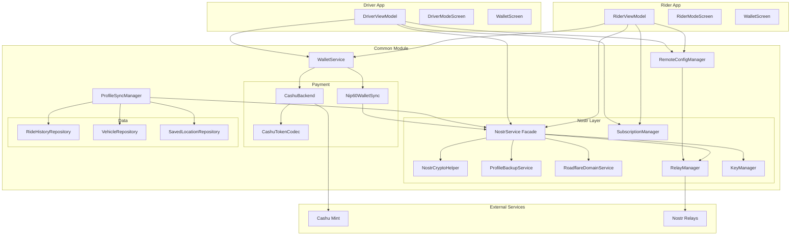
```mermaid
graph TB
    subgraph "Rider App"
        RVM[RiderViewModel]
        RMS[RiderModeScreen]
        RWS[WalletScreen]
    end

    subgraph "Driver App"
        DVM[DriverViewModel]
        DMS[DriverModeScreen]
        DWS[WalletScreen]
    end

    subgraph "Common Module"
        subgraph "Nostr Layer"
            NS[NostrService Facade]
            SM[SubscriptionManager]
            NCH[NostrCryptoHelper]
            PBS[ProfileBackupService]
            RDS[RoadflareDomainService]
            RM[RelayManager]
            KM[KeyManager]
        end

        WS[WalletService]
        PSM[ProfileSyncManager]
        RCM[RemoteConfigManager]

        subgraph "Payment"
            CB[CashuBackend]
            CTC[CashuTokenCodec]
            N60[Nip60WalletSync]
        end

        subgraph "Data"
            RHR[RideHistoryRepository]
            VR[VehicleRepository]
            SLR[SavedLocationRepository]
        end
    end

    subgraph "External Services"
        MINT[Cashu Mint]
        RELAYS[Nostr Relays]
    end

    RVM --> NS
    RVM --> SM
    RVM --> WS
    DVM --> NS
    DVM --> SM
    DVM --> WS

    NS --> NCH
    NS --> PBS
    NS --> RDS
    NS --> RM
    NS --> KM
    RM --> RELAYS

    WS --> CB
    WS --> N60
    CB --> CTC
    CB --> MINT
    N60 --> NS

    PSM --> NS
    PSM --> RHR
    PSM --> VR
    PSM --> SLR

    RCM --> RM
    RVM --> RCM
    DVM --> RCM
```

---

## Deposit Flow (Working)

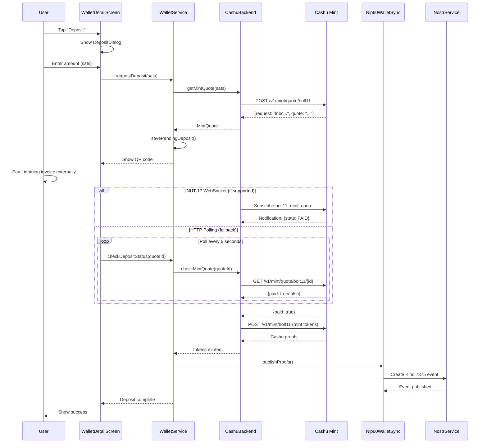
```mermaid
sequenceDiagram
    participant U as User
    participant WDS as WalletDetailScreen
    participant WS as WalletService
    participant CB as CashuBackend
    participant M as Cashu Mint
    participant N60 as Nip60WalletSync
    participant NS as NostrService

    U->>WDS: Tap "Deposit"
    WDS->>WDS: Show DepositDialog
    U->>WDS: Enter amount (sats)
    WDS->>WS: requestDeposit(sats)
    WS->>CB: getMintQuote(sats)
    CB->>M: POST /v1/mint/quote/bolt11
    M-->>CB: {request: "lnbc...", quote: "..."}
    CB-->>WS: MintQuote
    WS->>WS: savePendingDeposit()
    WS-->>WDS: Show QR code

    U->>U: Pay Lightning invoice externally

    alt NUT-17 WebSocket (if supported)
        CB->>M: Subscribe bolt11_mint_quote
        M-->>CB: Notification: {state: PAID}
    else HTTP Polling (fallback)
        loop Poll every 5 seconds
            WDS->>WS: checkDepositStatus(quoteId)
            WS->>CB: checkMintQuote(quoteId)
            CB->>M: GET /v1/mint/quote/bolt11/{id}
            M-->>CB: {paid: true/false}
        end
    end

    M-->>CB: {paid: true}
    CB->>M: POST /v1/mint/bolt11 (mint tokens)
    M-->>CB: Cashu proofs
    CB-->>WS: tokens minted
    WS->>N60: publishProofs()
    N60->>NS: Create Kind 7375 event
    NS-->>N60: Event published
    WS-->>WDS: Deposit complete
    WDS->>U: Show success
```

---

## Withdraw Flow (Working)

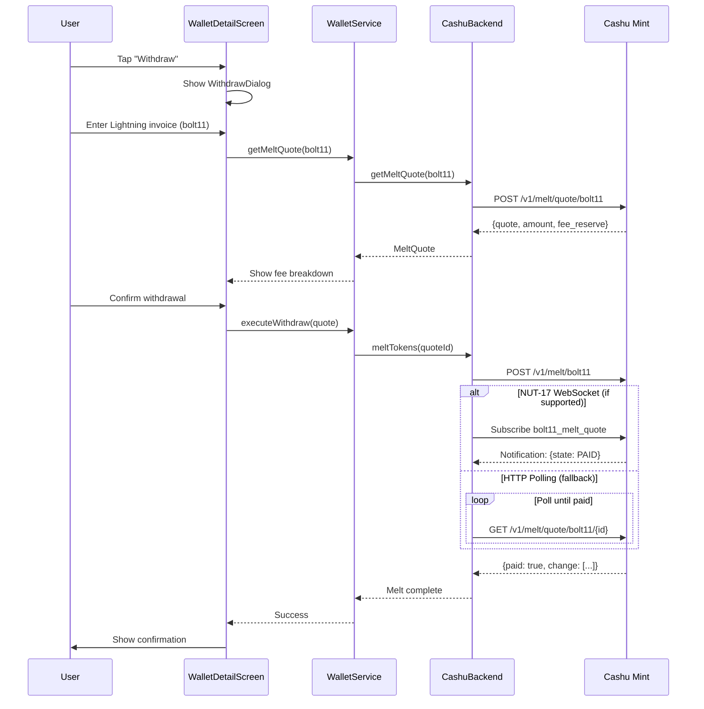
```mermaid
sequenceDiagram
    participant U as User
    participant WDS as WalletDetailScreen
    participant WS as WalletService
    participant CB as CashuBackend
    participant M as Cashu Mint

    U->>WDS: Tap "Withdraw"
    WDS->>WDS: Show WithdrawDialog
    U->>WDS: Enter Lightning invoice (bolt11)
    WDS->>WS: getMeltQuote(bolt11)
    WS->>CB: getMeltQuote(bolt11)
    CB->>M: POST /v1/melt/quote/bolt11
    M-->>CB: {quote, amount, fee_reserve}
    CB-->>WS: MeltQuote
    WS-->>WDS: Show fee breakdown

    U->>WDS: Confirm withdrawal
    WDS->>WS: executeWithdraw(quote)
    WS->>CB: meltTokens(quoteId)
    CB->>M: POST /v1/melt/bolt11
    alt NUT-17 WebSocket (if supported)
        CB->>M: Subscribe bolt11_melt_quote
        M-->>CB: Notification: {state: PAID}
    else HTTP Polling (fallback)
        loop Poll until paid
            CB->>M: GET /v1/melt/quote/bolt11/{id}
        end
    end
    M-->>CB: {paid: true, change: [...]}
    CB-->>WS: Melt complete
    WS-->>WDS: Success
    WDS->>U: Show confirmation
```

---

## Ride Payment Flow (HTLC Escrow)

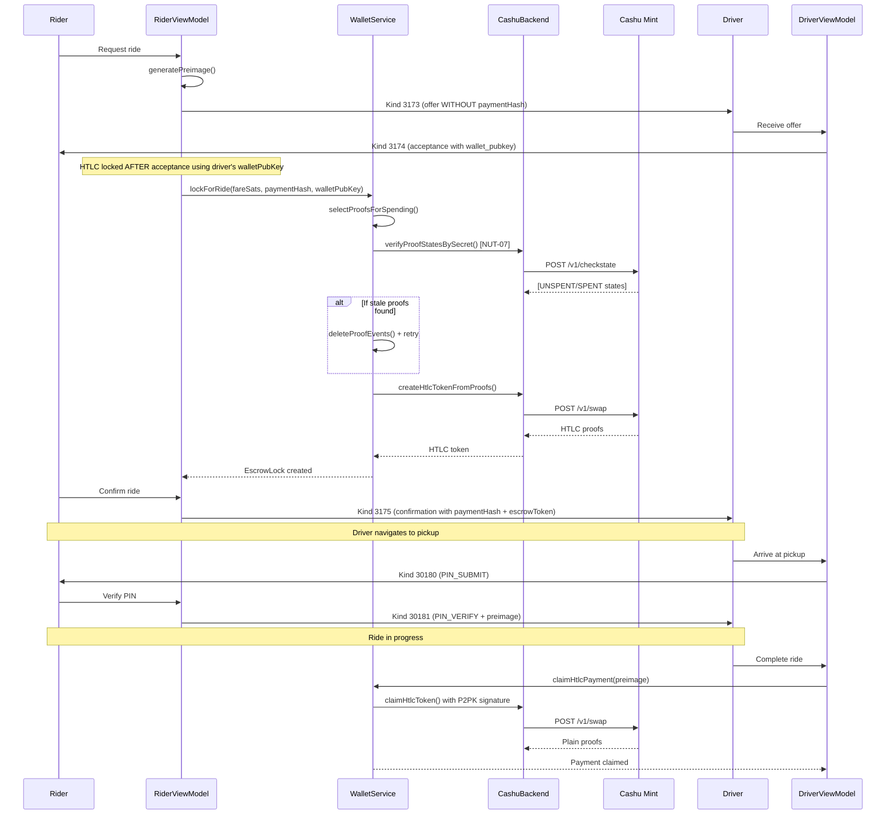
```mermaid
sequenceDiagram
    participant R as Rider
    participant RVM as RiderViewModel
    participant WS as WalletService
    participant CB as CashuBackend
    participant MINT as Cashu Mint
    participant D as Driver
    participant DVM as DriverViewModel

    R->>RVM: Request ride
    RVM->>RVM: generatePreimage()
    RVM->>D: Kind 3173 (offer WITHOUT paymentHash)
    D->>DVM: Receive offer
    DVM->>R: Kind 3174 (acceptance with wallet_pubkey)

    Note over RVM: HTLC locked AFTER acceptance using driver's walletPubKey

    RVM->>WS: lockForRide(fareSats, paymentHash, walletPubKey)
    WS->>WS: selectProofsForSpending()
    WS->>CB: verifyProofStatesBySecret() [NUT-07]
    CB->>MINT: POST /v1/checkstate
    MINT-->>CB: [UNSPENT/SPENT states]
    alt If stale proofs found
        WS->>WS: deleteProofEvents() + retry
    end
    WS->>CB: createHtlcTokenFromProofs()
    CB->>MINT: POST /v1/swap
    MINT-->>CB: HTLC proofs
    CB-->>WS: HTLC token
    WS-->>RVM: EscrowLock created

    R->>RVM: Confirm ride
    RVM->>D: Kind 3175 (confirmation with paymentHash + escrowToken)

    Note over R,D: Driver navigates to pickup

    D->>DVM: Arrive at pickup
    DVM->>R: Kind 30180 (PIN_SUBMIT)
    R->>RVM: Verify PIN
    RVM->>D: Kind 30181 (PIN_VERIFY + preimage)

    Note over R,D: Ride in progress

    D->>DVM: Complete ride
    DVM->>WS: claimHtlcPayment(preimage)
    WS->>CB: claimHtlcToken() with P2PK signature
    CB->>MINT: POST /v1/swap
    MINT-->>CB: Plain proofs
    WS-->>DVM: Payment claimed
```

---

## Offer Types Comparison

Ridestr supports three ways to request a ride, each with different privacy and discovery characteristics:

### Comparison Table

| Aspect | Direct Offer | Broadcast Offer | RoadFlare Offer |
|--------|--------------|-----------------|-----------------|
| **Kind 3173 Content** | NIP-44 encrypted | Plaintext (~1km approx) | NIP-44 encrypted |
| **Target** | Specific driver (p-tag) | All drivers in area (g-tags) | Specific driver (p-tag + roadflare tag) |
| **Driver Discovery** | Kind 30173 availability | Kind 30173 + geohash filter | Kind 30014 encrypted location |
| **Privacy** | High | Medium (approximate location public) | High |
| **Recommended** | ✅ Primary method | ⚠️ Advanced/Discouraged | ✅ Primary for trusted network |
| **Pre-requisites** | Driver broadcasting availability | Route calculated | Follower approved + key received |

### Direct Offer Flow (Primary)

Rider selects a specific driver from the map and sends an encrypted offer directly to them.

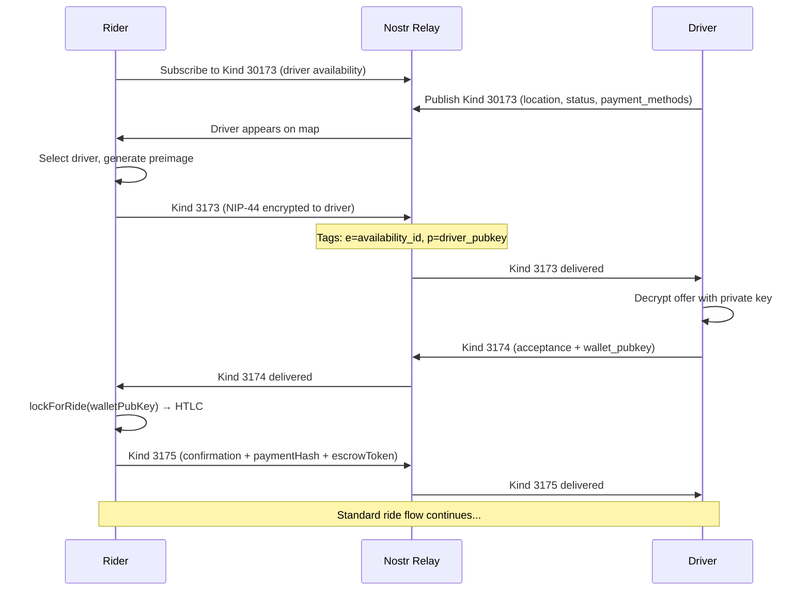
```mermaid
sequenceDiagram
    participant R as Rider
    participant N as Nostr Relay
    participant D as Driver

    R->>N: Subscribe to Kind 30173 (driver availability)
    D->>N: Publish Kind 30173 (location, status, payment_methods)
    N->>R: Driver appears on map

    R->>R: Select driver, generate preimage
    R->>N: Kind 3173 (NIP-44 encrypted to driver)
    Note over N: Tags: e=availability_id, p=driver_pubkey
    N->>D: Kind 3173 delivered
    D->>D: Decrypt offer with private key

    D->>N: Kind 3174 (acceptance + wallet_pubkey)
    N->>R: Kind 3174 delivered

    R->>R: lockForRide(walletPubKey) → HTLC
    R->>N: Kind 3175 (confirmation + paymentHash + escrowToken)
    N->>D: Kind 3175 delivered

    Note over R,D: Standard ride flow continues...
```

### Broadcast Offer Flow (Advanced/Discouraged)

Rider posts a public ride request visible to all drivers in the pickup area. First driver to accept wins.

**Privacy Warning:** This broadcasts approximate location (~1km) publicly to all Nostr users. UI shows privacy warning dialog before allowing broadcast.

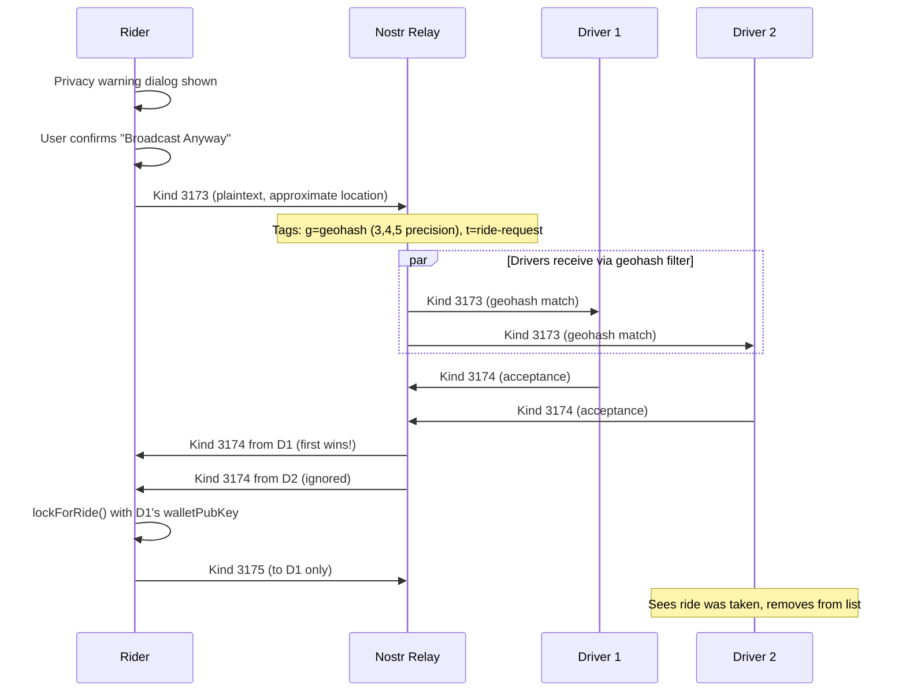
```mermaid
sequenceDiagram
    participant R as Rider
    participant N as Nostr Relay
    participant D1 as Driver 1
    participant D2 as Driver 2

    R->>R: Privacy warning dialog shown
    R->>R: User confirms "Broadcast Anyway"

    R->>N: Kind 3173 (plaintext, approximate location)
    Note over N: Tags: g=geohash (3,4,5 precision), t=ride-request

    par Drivers receive via geohash filter
        N->>D1: Kind 3173 (geohash match)
        N->>D2: Kind 3173 (geohash match)
    end

    D1->>N: Kind 3174 (acceptance)
    D2->>N: Kind 3174 (acceptance)

    N->>R: Kind 3174 from D1 (first wins!)
    N->>R: Kind 3174 from D2 (ignored)

    R->>R: lockForRide() with D1's walletPubKey
    R->>N: Kind 3175 (to D1 only)

    Note over D2: Sees ride was taken, removes from list
```

**Location Privacy:**
- Uses `location.approximate()` which rounds to ~1km precision (2 decimal places)
- Precise pickup only revealed to accepted driver in Kind 3175
- Progressive reveal: precise location shared when driver is within 1 mile

### RoadFlare Offer Flow (Trusted Network)

Rider is an approved follower of the driver and can see their encrypted real-time location.

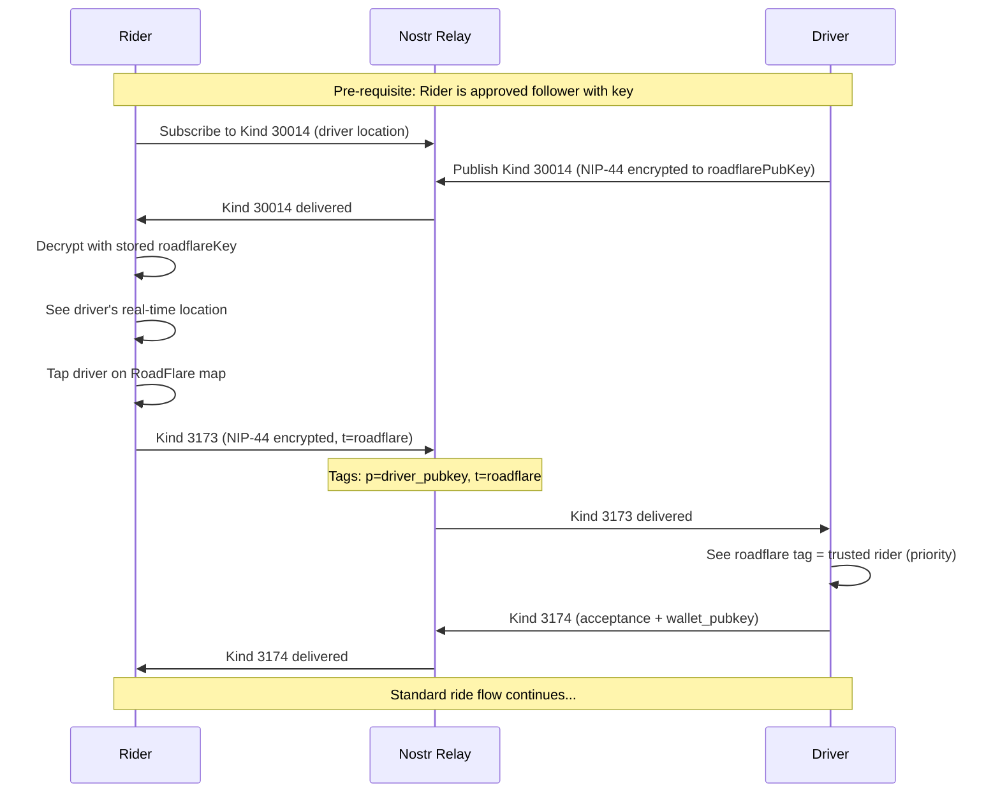
```mermaid
sequenceDiagram
    participant R as Rider
    participant N as Nostr Relay
    participant D as Driver

    Note over R,D: Pre-requisite: Rider is approved follower with key

    R->>N: Subscribe to Kind 30014 (driver location)
    D->>N: Publish Kind 30014 (NIP-44 encrypted to roadflarePubKey)
    N->>R: Kind 30014 delivered
    R->>R: Decrypt with stored roadflareKey
    R->>R: See driver's real-time location

    R->>R: Tap driver on RoadFlare map
    R->>N: Kind 3173 (NIP-44 encrypted, t=roadflare)
    Note over N: Tags: p=driver_pubkey, t=roadflare
    N->>D: Kind 3173 delivered
    D->>D: See roadflare tag = trusted rider (priority)

    D->>N: Kind 3174 (acceptance + wallet_pubkey)
    N->>R: Kind 3174 delivered

    Note over R,D: Standard ride flow continues...
```

**RoadFlare Benefits:**
- Encrypted location (only followers can see)
- Priority treatment (RoadFlare offers sorted first)
- Alternate payment methods supported (Zelle, PayPal, etc.)

### Key Implementation Files

| Offer Type | RiderViewModel Method | NostrService Method | RideOfferEvent Method |
|------------|----------------------|---------------------|----------------------|
| Direct | `sendRideOffer()` | `sendRideOffer()` | `create()` |
| Broadcast | `broadcastRideRequest()` | `broadcastRideRequest()` | `createBroadcast()` |
| RoadFlare | `sendRoadflareOffer()` | `sendRideOffer()` | `create()` (isRoadflare=true) |

---

## Cross-Mint Bridge Payment Flow (Multi-Mint)

When rider and driver use different Cashu mints, payment happens via Lightning bridge:

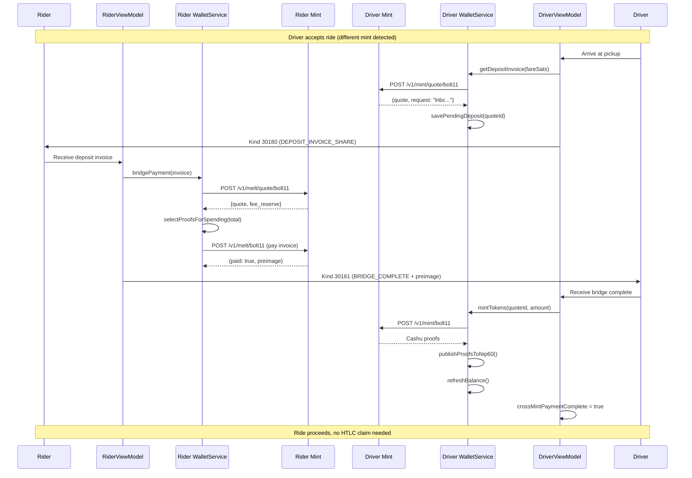
```mermaid
sequenceDiagram
    participant R as Rider
    participant RVM as RiderViewModel
    participant RWS as Rider WalletService
    participant RM as Rider Mint
    participant DM as Driver Mint
    participant DWS as Driver WalletService
    participant DVM as DriverViewModel
    participant D as Driver

    Note over R,D: Driver accepts ride (different mint detected)

    D->>DVM: Arrive at pickup
    DVM->>DWS: getDepositInvoice(fareSats)
    DWS->>DM: POST /v1/mint/quote/bolt11
    DM-->>DWS: {quote, request: "lnbc..."}
    DWS->>DWS: savePendingDeposit(quoteId)
    DVM->>R: Kind 30180 (DEPOSIT_INVOICE_SHARE)

    R->>RVM: Receive deposit invoice
    RVM->>RWS: bridgePayment(invoice)
    RWS->>RM: POST /v1/melt/quote/bolt11
    RM-->>RWS: {quote, fee_reserve}
    RWS->>RWS: selectProofsForSpending(total)
    RWS->>RM: POST /v1/melt/bolt11 (pay invoice)
    RM-->>RWS: {paid: true, preimage}
    RVM->>D: Kind 30181 (BRIDGE_COMPLETE + preimage)

    D->>DVM: Receive bridge complete
    DVM->>DWS: mintTokens(quoteId, amount)
    DWS->>DM: POST /v1/mint/bolt11
    DM-->>DWS: Cashu proofs
    DWS->>DWS: publishProofsToNip60()
    DWS->>DWS: refreshBalance()
    DVM->>DVM: crossMintPaymentComplete = true

    Note over R,D: Ride proceeds, no HTLC claim needed
```

**Key Points:**
- `shareDepositInvoice()` saves quote to `WalletStorage` for recovery
- `handleBridgeComplete()` calls `mintTokens()` to claim proofs
- `crossMintPaymentComplete` flag prevents MISSING_ESCROW_TOKEN error at dropoff
- Unclaimed deposits persist in local storage until claimed or manually cleared
- Developer Options → "Claim Unclaimed Deposits" for manual recovery

---

## Profile Sync Flow (Key Import)

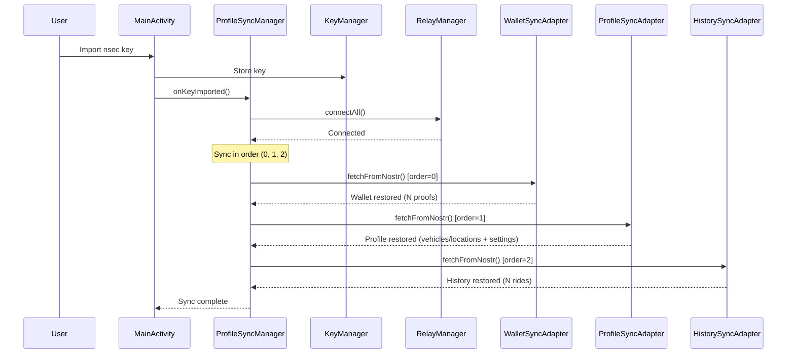
```mermaid
sequenceDiagram
    participant U as User
    participant MA as MainActivity
    participant PSM as ProfileSyncManager
    participant KM as KeyManager
    participant RM as RelayManager
    participant SA1 as WalletSyncAdapter
    participant SA2 as ProfileSyncAdapter
    participant SA3 as HistorySyncAdapter

    U->>MA: Import nsec key
    MA->>KM: Store key
    MA->>PSM: onKeyImported()

    PSM->>RM: connectAll()
    RM-->>PSM: Connected

    Note over PSM: Sync in order (0, 1, 2)

    PSM->>SA1: fetchFromNostr() [order=0]
    SA1-->>PSM: Wallet restored (N proofs)

    PSM->>SA2: fetchFromNostr() [order=1]
    SA2-->>PSM: Profile restored (vehicles/locations + settings)

    PSM->>SA3: fetchFromNostr() [order=2]
    SA3-->>PSM: History restored (N rides)

    PSM-->>MA: Sync complete
```

---

## Cross-Module Dependencies

### Payment System

```
Payment System (Phase 5 Reorganization)
├── WalletService (orchestration layer - with region comments)
│   ├── Depends on: CashuBackend (mint operations)
│   ├── Depends on: WalletStorage (local persistence, pending ops)
│   ├── Depends on: Nip60WalletSync (cross-device sync)
│   ├── Depends on: WalletKeyManager (wallet identity)
│   ├── Regions: INSTANCE STATE, LIFECYCLE, BALANCE & SYNC, HTLC PAYMENT FLOWS (with invariants),
│   │           DEPOSITS, WITHDRAWALS, CROSS-MINT BRIDGE, NIP-60 SYNC, DIAGNOSTICS, RECOVERY
│   ├── Key method: syncWallet() - THE sync function (NIP-60 is source of truth)
│   ├── Key method: ensureWalletReady(amount) - pre-ride NUT-07 verification + stale proof cleanup
│   ├── Key method: recoverPendingOperations() - recover blinded ops on connect
│   ├── CRITICAL: Safe deletion pattern - always republish remaining proofs before deleteProofEvents()
│   ├── CRITICAL: pendingOpId must be cleared AFTER NIP-60 publish (or RecoveryToken fallback)
│   └── Used by: RiderViewModel, DriverViewModel, WalletDetailScreen, WalletSettingsScreen
│
├── CashuBackend (NUT-04/05/14/17 implementation - with region comments)
│   ├── Depends on: cdk-kotlin library
│   ├── Depends on: WalletStorage (pending blinded operations)
│   ├── Depends on: CashuWebSocket (NUT-17 real-time updates)
│   ├── Depends on: CashuTokenCodec (token encoding/decoding)
│   ├── Connects to: Cashu Mint (HTTP REST + WebSocket)
│   ├── Regions: INSTANCE STATE, LIFECYCLE, MINT API QUOTES (NUT-04/05), PROOF VERIFICATION (NUT-07),
│   │           HTLC ESCROW (NUT-14) with invariants, TOKEN ENCODING, MINTING, MELTING,
│   │           KEYSET MANAGEMENT, RECOVERY (NUT-09), UTILITIES
│   ├── NUT-17: waitForMeltQuoteState(), waitForMintQuoteState() - WebSocket with polling fallback
│   ├── CRITICAL: All blinded ops save premints BEFORE request, return pendingOpId
│   ├── Caller clears pendingOpId after persisting proofs (NIP-60 or RecoveryToken)
│   └── Used by: WalletService
│
├── CashuTokenCodec (~200 lines, stateless utilities)
│   ├── Extracted from CashuBackend for better organization
│   ├── HtlcProof data class (amount, id, secret, C)
│   ├── Token encoding: encodeHtlcProofsAsToken(), encodeProofsAsToken()
│   ├── Token decoding: parseHtlcToken()
│   ├── HTLC secret parsing: extractPaymentHashFromSecret(), extractLocktimeFromSecret(), extractRefundKeysFromSecret()
│   └── Used by: CashuBackend
│
├── Nip60Store Interface (Phase 6 - Testable Abstraction)
│   ├── Interface for NIP-60 operations (enables dependency injection)
│   ├── Methods: publishProofs(), fetchProofs(), selectProofsForSpending()
│   ├── Methods: deleteProofEvents(), publishWalletMetadata()
│   ├── Methods: getBalance(), hasExistingWallet(), restoreFromNostr()
│   ├── Implementation: Nip60WalletSync
│   └── Test Double: FakeNip60Store (in test sources)
│
├── Test Infrastructure (Phase 6 + Phase 4 - 204 tests)
│   ├── FakeMintApi - Queue mock responses for swap/checkstate
│   │   ├── queueSwapSuccess(), queueSwapHttpError(), queueSwapTransportFailure()
│   │   └── queueCheckstateSuccess(), queueCheckstateHttpError()
│   ├── FakeNip60Store - Mock NIP-60 storage with verification
│   │   ├── Implements Nip60Store interface
│   │   ├── getCallLog() - Returns ordered list of operations
│   │   └── verifyPublishBeforeDelete() - Asserts safe deletion pattern
│   ├── CashuBackend.setTestState() - Bypass HTTP for unit tests
│   │   ├── Sets currentMintUrl, testActiveKeyset, walletSeed directly
│   │   └── @VisibleForTesting annotation for safety
│   ├── MainDispatcherRule - JUnit rule for Dispatchers.Main override
│   ├── Test Files (204 tests total):
│   │   ├── PaymentCryptoTest.kt (23) - Preimage/hash generation
│   │   ├── CashuCryptoTest.kt (30) - hashToCurve, NUT-13, BIP-39
│   │   ├── CashuTokenCodecTest.kt (30) - Token encoding/decoding
│   │   ├── HtlcResultTest.kt (23) - Sealed class exhaustiveness
│   │   ├── CashuBackendErrorTest.kt (32) - Error mapping with FakeMintApi
│   │   ├── FakeNip60StoreTest.kt (32) - Mock NIP-60 API behavior
│   │   ├── ProofConservationTest.kt (10) - Proof safety invariants
│   │   └── SubscriptionManagerTest.kt (23) - Subscription lifecycle, auto-close, groups
│   └── Dependencies: MockK, Robolectric, androidx.test.core, kotlinx-coroutines-test
│
├── CashuWebSocket (NUT-17 WebSocket subscriptions)
│   ├── Depends on: OkHttp WebSocket
│   ├── Connects to: Cashu Mint (wss://mint.example.com/v1/ws)
│   ├── Subscription kinds: bolt11_mint_quote, bolt11_melt_quote, proof_state
│   ├── Auto-reconnection with exponential backoff
│   ├── Callbacks: onMintQuoteUpdate, onMeltQuoteUpdate, onProofStateUpdate
│   └── Used by: CashuBackend
│
├── Nip60WalletSync (NIP-60 wallet backup - FULLY COMPLIANT + Cross-App Safe)
│   ├── Depends on: NostrService (event publishing)
│   ├── Depends on: KeyManager (signing)
│   ├── Depends on: WalletKeyManager (wallet key backup)
│   ├── Kind 7375: {"mint":"...","proofs":[...]} - NIP-60 standard
│   ├── Kind 17375: [["privkey","..."],["mint","..."]] - NIP-60 standard
│   ├── IMPORTANT: One Kind 7375 event can contain MANY proofs (same eventId)
│   ├── SAFETY: getExistingWalletMetadata() - check before overwriting other app's data
│   ├── SAFETY: publishWalletMetadata(forceOverwrite) - explicit param for overwrites
│   └── Used by: WalletService, Nip60WalletSyncAdapter
│
└── PaymentCrypto (preimage/hash utilities)
    └── Used by: RiderViewModel (escrow creation)
```

### Nostr Layer

```
Nostr Layer (Phase 5 Domain Decomposition)
├── NostrService (facade - delegates to domain services)
│   ├── Depends on: RelayManager (WebSocket connections)
│   ├── Depends on: KeyManager (event signing)
│   ├── Depends on: NostrCryptoHelper (encryption)
│   ├── Depends on: ProfileBackupService (profile/history backup)
│   ├── Depends on: RoadflareDomainService (RoadFlare events)
│   ├── Depends on: RideshareDomainService (ride protocol events)
│   ├── Used by: RiderViewModel, DriverViewModel
│   ├── Used by: All SyncAdapters
│   └── Used by: Nip60WalletSync
│   Note: Facade keeps all existing method signatures for backward compatibility
│
├── NostrCryptoHelper (~150 lines)
│   ├── Depends on: KeyManager (signing)
│   ├── Methods: encryptForUser(), decryptFromUser()
│   ├── Methods: encryptLocationForRiderState(), decryptLocationFromRiderState()
│   ├── Methods: encryptPinForDriverState(), decryptPinFromDriverState()
│   └── Used by: NostrService (delegation)
│
├── ProfileBackupService (~500 lines)
│   ├── Depends on: RelayManager, KeyManager
│   ├── State: userDisplayName StateFlow
│   ├── Profile: publishProfile(), subscribeToProfile(), subscribeToOwnProfile()
│   ├── History: publishRideHistoryBackup(), fetchRideHistory(), deleteRideHistoryBackup()
│   ├── Unified: publishProfileBackup(), fetchProfileBackup() (Kind 30177)
│   ├── Legacy: backupVehicles(), backupSavedLocations() (Kind 30175/30176)
│   └── Used by: NostrService (delegation)
│
├── RoadflareDomainService (~600 lines)
│   ├── Depends on: RelayManager, KeyManager, NostrCryptoHelper
│   ├── Followed: publishFollowedDrivers(), fetchFollowedDrivers() (Kind 30011)
│   ├── State: publishDriverRoadflareState(), fetchDriverRoadflareState() (Kind 30012)
│   ├── Location: publishRoadflareLocation(), subscribeToRoadflareLocations() (Kind 30014)
│   ├── Keys: publishRoadflareKeyShare(), subscribeToRoadflareKeyShares() (Kind 3186)
│   ├── Ack: publishRoadflareKeyAck(), subscribeToRoadflareKeyAcks() (Kind 3188)
│   └── Used by: NostrService (delegation)
│
├── RideshareDomainService (~900 lines)
│   ├── Depends on: RelayManager, KeyManager
│   ├── Availability: broadcastAvailability(), subscribeToDrivers(), subscribeToDriverAvailability() (Kind 30173)
│   ├── Offers: sendRideOffer(), broadcastRideRequest(), subscribeToBroadcastRideRequests(), subscribeToOffers() (Kind 3173)
│   ├── Acceptance: acceptRide(), acceptBroadcastRide(), subscribeToAcceptance(), subscribeToAcceptancesForOffer() (Kind 3174)
│   ├── Confirmation: confirmRide(), subscribeToConfirmation() (Kind 3175)
│   ├── DriverState: publishDriverRideState(), subscribeToDriverRideState() (Kind 30180)
│   ├── RiderState: publishRiderRideState(), subscribeToRiderRideState() (Kind 30181)
│   ├── Chat: sendChatMessage(), subscribeToChatMessages() (Kind 3178)
│   ├── Cancel: publishRideCancellation(), subscribeToCancellation() (Kind 3179)
│   ├── Deletions: subscribeToRideRequestDeletions() (Kind 5)
│   └── Used by: NostrService (delegation)
│
├── SubscriptionManager (Phase 4 - subscription lifecycle)
│   ├── Depends on: NostrService.closeSubscription() (callback)
│   ├── Singular: set(), get(), close(), closeAll(vararg keys)
│   ├── Groups: setInGroup(), closeInGroup(), closeGroup(), groupContains()
│   ├── Thread-safe: synchronized lock, relay I/O outside lock
│   ├── Auto-closes old subscription when setting new one for same key
│   └── Used by: RiderViewModel (SubKeys: DRIVERS, ACCEPTANCE, CHAT, etc.), DriverViewModel (SubKeys: OFFERS, DELETION, etc.)
│
├── RelayManager (connection pool)
│   ├── Connects to: Nostr Relays (WebSocket)
│   ├── Used by: NostrService and all domain services
│   └── Used by: ProfileSyncManager
│
├── KeyManager (Nostr identity)
│   ├── Depends on: SecureKeyStorage
│   ├── Used by: NostrService and all domain services
│   ├── Used by: ProfileSyncManager (shared singleton)
│   └── Used by: Nip60WalletSync
│
└── Event Models (events/*.kt)
    ├── 8 ride protocol events (Kind 30173, 3173, 3174, 3175, 30180, 30181, 3178, 3179)
    ├── 2 backup events (Kind 30174 history, 30177 profile)
    └── Used by: NostrService methods
```

### Profile Sync

```
Profile Sync
├── ProfileSyncManager (orchestrator singleton)
│   ├── Depends on: KeyManager (shared)
│   ├── Depends on: RelayManager (shared)
│   ├── Manages: All registered SyncAdapters
│   ├── Used by: MainActivity (both apps)
│   └── backupProfileData() - called by auto-backup observers
│
├── Nip60WalletSyncAdapter (order=0)
│   ├── Depends on: Nip60WalletSync
│   └── Restores: Cashu proofs (Kind 7375)
│
├── ProfileSyncAdapter (order=1) ★ UNIFIED
│   ├── Depends on: VehicleRepository (driver)
│   ├── Depends on: SavedLocationRepository (rider)
│   ├── Depends on: SettingsManager (settings sync)
│   ├── Depends on: NostrService
│   └── Restores: Kind 30177 (vehicles + locations + settings)
│
└── RideHistorySyncAdapter (order=2)
    ├── Depends on: RideHistoryRepository
    ├── Depends on: NostrService
    └── Restores: Ride history (Kind 30174)

Auto-Backup Flow (MainActivity observers):
├── Driver: vehicleRepository.vehicles → backupProfileData()
├── Rider: savedLocationRepo.savedLocations → backupProfileData()
└── Both: settingsManager.syncableSettingsHash → backupProfileData()
    └── syncableSettingsHash combines: displayCurrency, distanceUnit,
        notificationSettings, autoOpenNavigation, alwaysAskVehicle,
        paymentMethods, defaultPaymentMethod, mintUrl, customRelays,
        roadflarePaymentMethods
```

### State Machines

```
State Machines
├── RiderViewModel
│   ├── Depends on: NostrService (event pub/sub)
│   ├── Depends on: WalletService (payment locking)
│   ├── Depends on: RideHistoryRepository (ride storage)
│   ├── Depends on: SavedLocationRepository (location storage)
│   ├── Publishes: Kind 3173, 3175, 30181 events
│   └── Subscribes: Kind 30173, 3174, 30180, 3179 events
│
├── RiderViewModel
│   ├── Depends on: NostrService (event pub/sub)
│   ├── Depends on: WalletService (payment locking, ensureWalletReady)
│   ├── Depends on: RideHistoryRepository (ride storage)
│   ├── Depends on: SavedLocationRepository (location storage)
│   ├── Depends on: FollowedDriversRepository (RoadFlare drivers)
│   ├── Publishes: Kind 3173, 3175, 30181 events
│   └── Subscribes: Kind 30173, 3174, 30180, 3179 events
│
└── DriverViewModel
    ├── Depends on: NostrService (event pub/sub)
    ├── Depends on: WalletService (payment claiming)
    ├── Depends on: RideHistoryRepository (ride storage)
    ├── Depends on: VehicleRepository (vehicle data)
    ├── Depends on: RoadflareLocationBroadcaster (location broadcast lifecycle)
    ├── Depends on: DriverRoadflareRepository (follower/key state)
    ├── Publishes: Kind 30173, 3174, 30180, 3179, 30014 events
    └── Subscribes: Kind 3173, 3175, 30181 events
```

---

## Event Kind Reference

| Kind | Name | Publisher | Subscriber | Purpose |
|------|------|-----------|------------|---------|
| 30173 | Driver Availability | Driver | Rider | Driver broadcasts location/status + mint_url/payment_methods |
| 3173 | Ride Offer | Rider | Driver | Rider requests ride + mint_url/payment_method (encrypted) |
| 3174 | Ride Acceptance | Driver | Rider | Driver accepts + mint_url/payment_method |
| 3175 | Ride Confirmation | Rider | Driver | Rider confirms with PIN |
| 30180 | Driver Ride State | Driver | Rider | Status updates, PIN submission |
| 30181 | Rider Ride State | Rider | Driver | Location reveal, PIN verify, preimage |
| 3178 | Chat | Both | Both | In-ride messaging (encrypted) |
| 3179 | Cancellation | Both | Both | Ride cancellation |
| 30174 | Ride History | Self | Self | Backup (encrypted to self) |
| 30177 | Unified Profile | Self | Self | Vehicles, locations, settings + payment prefs |
| 30182 | Admin Config | Admin | All Apps | Platform config (fare rates, recommended mints) |
| 7375 | Wallet Proofs | Self | Self | NIP-60 wallet proofs (encrypted) |
| 17375 | Wallet Metadata | Self | Self | NIP-60 wallet metadata (encrypted) |
| **30011** | Followed Drivers | Rider | Rider | RoadFlare: favorite drivers + keys (to self) |
| **30012** | Driver RoadFlare State | Driver | Driver | RoadFlare: keypair, followers, muted (to self) |
| **30014** | RoadFlare Location | Driver | Rider | RoadFlare: encrypted location broadcast |
| **3186** | RoadFlare Key Share | Driver | Rider | RoadFlare: private key DM to follower |
| **3187** | Follow Notification | Rider | Driver | RoadFlare: follow notification (real-time UX) |
| **3188** | Key Acknowledgement | Rider | Driver | RoadFlare: key receipt confirmation (5-min expiry) |

### NIP-60 Wallet Event Formats (January 2026 - Fully Compliant)

**Kind 7375 - Proof Events** (JSON object):
```json
{"mint": "https://mint.example.com", "proofs": [{"id":"...","amount":1,"secret":"...","C":"..."}]}
```

**Kind 17375 - Wallet Metadata** (Array of tag-like pairs):
```json
[["privkey", "hex_wallet_key"], ["mint", "https://mint.example.com"], ["mnemonic", "word1 word2..."]]
```

Both are NIP-44 encrypted to user's pubkey. The `mnemonic` field is a custom extension for cdk-kotlin recovery.

### Multi-Mint Support (Issue #13 - Phase 1)

Protocol events now include payment method fields for multi-mint compatibility:

```
PaymentMethod enum (RideshareEventKinds.kt)
├── CASHU - Cashu ecash (NUT-14 HTLC)
├── LIGHTNING - Lightning Network direct
├── FIAT_CASH - Cash on delivery
└── RoadFlare Alternate Methods:
    ├── ZELLE - Zelle
    ├── PAYPAL - PayPal
    ├── CASH_APP - Cash App
    ├── VENMO - Venmo
    ├── CASH - Cash
    └── STRIKE - Strike

Fields added to events:
├── Kind 30173 (Availability): mint_url, payment_methods[]
├── Kind 3173 (Offer): mint_url, payment_method
├── Kind 3174 (Acceptance): mint_url, payment_method
└── Kind 30177 (Profile): settings.paymentMethods[], settings.defaultPaymentMethod, settings.mintUrl
```

---

## Payment Methods

### Status Overview

| Method | Enum Value | Status | Implementation |
|--------|------------|--------|----------------|
| **Cashu HTLC** | `CASHU` | ✅ Working | NUT-14 escrow with deferred locking |
| **Lightning Direct** | `LIGHTNING` | 🚧 Planned | Driver generates invoice, rider pays |
| **Fiat Cash** | `FIAT_CASH` | 🚧 Planned | Cash on delivery, trust-based |
| **RoadFlare Alternates** | Various | ✅ Working | External apps (Zelle, PayPal, etc.) |

### Cashu HTLC Payment Flow (Current)

The payment system uses NUT-14 Hash Time-Locked Contracts with **deferred locking** - HTLC is created AFTER driver acceptance using driver's `wallet_pubkey`.

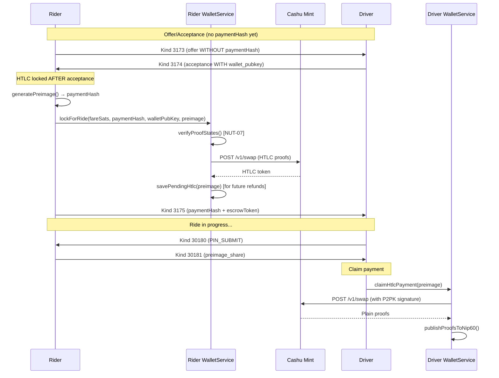
```mermaid
sequenceDiagram
    participant R as Rider
    participant RWS as Rider WalletService
    participant MINT as Cashu Mint
    participant D as Driver
    participant DWS as Driver WalletService

    Note over R,D: Offer/Acceptance (no paymentHash yet)
    R->>D: Kind 3173 (offer WITHOUT paymentHash)
    D->>R: Kind 3174 (acceptance WITH wallet_pubkey)

    Note over R: HTLC locked AFTER acceptance
    R->>R: generatePreimage() → paymentHash
    R->>RWS: lockForRide(fareSats, paymentHash, walletPubKey, preimage)
    RWS->>RWS: verifyProofStates() [NUT-07]
    RWS->>MINT: POST /v1/swap (HTLC proofs)
    MINT-->>RWS: HTLC token
    RWS->>RWS: savePendingHtlc(preimage) [for future refunds]

    R->>D: Kind 3175 (paymentHash + escrowToken)

    Note over R,D: Ride in progress...

    D->>R: Kind 30180 (PIN_SUBMIT)
    R->>D: Kind 30181 (preimage_share)

    Note over D: Claim payment
    D->>DWS: claimHtlcPayment(preimage)
    DWS->>MINT: POST /v1/swap (with P2PK signature)
    MINT-->>DWS: Plain proofs
    DWS->>DWS: publishProofsToNip60()
```

**Critical Design: Nostr Key ≠ Wallet Key**

For security isolation, identity and payment use **different keys**:
- **Nostr key**: User identity, event signing, NIP-44 encryption
- **Wallet key**: P2PK escrow claims, BIP-340 Schnorr signatures

Driver's `wallet_pubkey` in Kind 3174 ensures HTLC is locked to correct key. Without this, payment claims fail with "invalid signature".

**HTLC Preimage Storage (January 2026)**

Preimage is now stored in `PendingHtlc` for future-proof refunds:
- If driver doesn't claim before locktime, rider can refund
- `refundExpiredHtlc()` uses stored preimage if available
- Falls back to zeros for old HTLCs (mint compatibility workaround)

### RoadFlare Alternate Payment Methods

RoadFlare rides support non-HTLC payment methods for trusted relationships:

| Method | Enum | Settlement |
|--------|------|------------|
| Zelle | `ZELLE` | External app |
| PayPal | `PAYPAL` | External app |
| Cash App | `CASH_APP` | External app |
| Venmo | `VENMO` | External app |
| Cash | `CASH` | In-person |
| Strike | `STRIKE` | Lightning via Strike |

These bypass wallet balance checks and HTLC escrow entirely - payment handled outside the app.

### Payment Path Detection

When rider and driver use different mints, the system detects cross-mint scenario:

```
Payment Path Detection (WalletService)
├── SAME_MINT: riderMintUrl == driverMintUrl → HTLC escrow
├── CROSS_MINT: riderMintUrl != driverMintUrl → Lightning bridge
└── NO_ESCROW: RoadFlare alternate methods → External settlement
```

Cross-mint bridge executes at PIN verification (see Cross-Mint Bridge Payment Flow above).

---

## Security Hardening (January 2026)

### Summary

| Component | Description | Status |
|-----------|-------------|--------|
| **Backup Exclusions** | Secrets excluded from Android cloud backup | ✅ |
| **Pubkey Validation** | Event parsers verify expected pubkey | ✅ |
| **WebSocket Concurrency** | Bounded channels, generation tracking | ✅ |
| **Signature Verification** | Relay-level NIP-01 Schnorr verification | ✅ |
| **Encryption Fallback Warning** | Warns when storage falls back to plaintext | ✅ |

### Signature Verification Flow

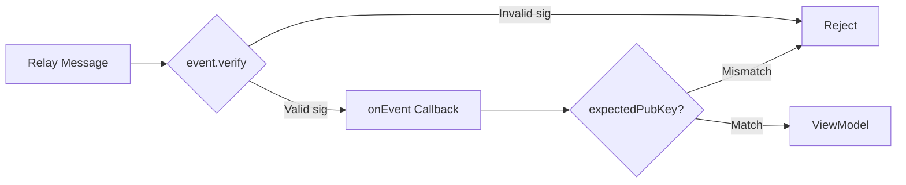
```mermaid
flowchart LR
    A[Relay Message] --> B{event.verify}
    B -->|Invalid sig| C[Reject]
    B -->|Valid sig| D[onEvent Callback]
    D --> E{expectedPubKey?}
    E -->|Mismatch| C
    E -->|Match| F[ViewModel]
```

### Event Parsers with Pubkey Validation

| Parser | Expected Pubkey | File |
|--------|-----------------|------|
| `RideAcceptanceEvent.parse()` | `expectedDriverPubKey` | `RideAcceptanceEvent.kt:25` |
| `RideConfirmationEvent.parseEncrypted()` | `expectedRiderPubKey` | `RideConfirmationEvent.kt:30` |
| `DriverRideStateEvent.parse()` | `expectedDriverPubKey` | `DriverRideStateEvent.kt` |
| `RiderRideStateEvent.parse()` | `expectedRiderPubKey` | `RiderRideStateEvent.kt` |

### Backup Exclusions

Both apps exclude sensitive SharedPreferences from Android cloud backup:

**Excluded Files** (in `backup_rules.xml`):
- `ridestr_secure_keys.xml` - Nostr private key
- `ridestr_wallet_keys.xml` - Wallet mnemonic
- `ridestr_wallet_storage.xml` - Wallet proofs, counters
- `ridestr_settings.xml` - User preferences
- `ridestr_ride_history.xml` - Ride history
- `ridestr_saved_locations.xml` - Saved locations
- `roadflare_*.xml` - RoadFlare state

**Recovery Path:** Nostr sync (Kind 30174 history, Kind 30177 profile, Kind 7375 wallet proofs)

### WebSocket Concurrency (RelayConnection.kt)

Prevents memory exhaustion and race conditions:

```kotlin
private val messageChannel = Channel<Pair<Long, String>>(capacity = 256)
private var connectionGeneration = 0L  // Increments on connect()
```

- **Bounded queue (256)**: Prevents memory exhaustion under bursty traffic
- **Generation tracking**: Prevents stale callback corruption after reconnect
- **Synchronized state**: Race condition protection for socket operations

---

## Critical Connection Points

### Must Call Together

| Operation | Required Calls | Why |
|-----------|----------------|-----|
| Accept ride (driver) | `clearDriverStateHistory()` + `acceptOffer()` | Prevents phantom cancellation |
| Start new ride (rider) | `clearRiderStateHistory()` before new ride | Prevents history pollution |
| Login/Key import | `keyManager.refreshFromStorage()` on both NostrService AND ProfileSyncManager | Ensures shared key state |
| Wallet connection | `walletService.setNip60Sync()` after creating Nip60WalletSync | Enables cross-device sync |

### Cannot Be Removed Without Breaking

| Component | Used By | Impact if Removed |
|-----------|---------|-------------------|
| `KeyManager` (singleton) | NostrService, ProfileSyncManager, Nip60WalletSync | All signing/encryption breaks |
| `RelayManager` | NostrService, ProfileSyncManager | All Nostr communication breaks |
| `WalletService.balance` | WalletScreen (both apps), RiderViewModel | Balance display + ride checks break |
| `RideHistoryRepository` | Both ViewModels, HistorySyncAdapter | History tracking breaks |

---

## File Path Quick Reference

| Component | Path |
|-----------|------|
| **Rider ViewModel** | `rider-app/src/main/java/com/ridestr/rider/viewmodels/RiderViewModel.kt` |
| **Driver ViewModel** | `drivestr/src/main/java/com/drivestr/app/viewmodels/DriverViewModel.kt` |
| **NostrService (facade)** | `common/src/main/java/com/ridestr/common/nostr/NostrService.kt` |
| **NostrCryptoHelper** | `common/src/main/java/com/ridestr/common/nostr/NostrCryptoHelper.kt` |
| **ProfileBackupService** | `common/src/main/java/com/ridestr/common/nostr/ProfileBackupService.kt` |
| **RoadflareDomainService** | `common/src/main/java/com/ridestr/common/nostr/RoadflareDomainService.kt` |
| **RideshareDomainService** | `common/src/main/java/com/ridestr/common/nostr/RideshareDomainService.kt` |
| **SubscriptionManager** | `common/src/main/java/com/ridestr/common/nostr/SubscriptionManager.kt` |
| **WalletService** | `common/src/main/java/com/ridestr/common/payment/WalletService.kt` |
| **CashuBackend** | `common/src/main/java/com/ridestr/common/payment/cashu/CashuBackend.kt` |
| **CashuTokenCodec** | `common/src/main/java/com/ridestr/common/payment/cashu/CashuTokenCodec.kt` |
| **ProfileSyncManager** | `common/src/main/java/com/ridestr/common/sync/ProfileSyncManager.kt` |
| **KeyManager** | `common/src/main/java/com/ridestr/common/nostr/keys/KeyManager.kt` |
| **RelayManager** | `common/src/main/java/com/ridestr/common/nostr/relay/RelayManager.kt` |
| **WalletDetailScreen** | `common/src/main/java/com/ridestr/common/ui/WalletDetailScreen.kt` |
| **WalletSettingsScreen** | `common/src/main/java/com/ridestr/common/ui/WalletSettingsScreen.kt` |
| **KeyBackupScreen** | `common/src/main/java/com/ridestr/common/ui/screens/KeyBackupScreen.kt` |
| **ProfileSetupContent** | `common/src/main/java/com/ridestr/common/ui/screens/ProfileSetupContent.kt` |
| **OnboardingComponents** | `common/src/main/java/com/ridestr/common/ui/screens/OnboardingComponents.kt` |
| **SettingsComponents** | `common/src/main/java/com/ridestr/common/ui/components/SettingsComponents.kt` |
| **RideHistoryRepository** | `common/src/main/java/com/ridestr/common/data/RideHistoryRepository.kt` |
| **FollowedDriversRepository** | `common/src/main/java/com/ridestr/common/data/FollowedDriversRepository.kt` |
| **DriverRoadflareRepository** | `common/src/main/java/com/ridestr/common/data/DriverRoadflareRepository.kt` |
| **RoadflareKeyManager** | `common/src/main/java/com/ridestr/common/roadflare/RoadflareKeyManager.kt` |
| **RoadflareLocationBroadcaster** | `common/src/main/java/com/ridestr/common/roadflare/RoadflareLocationBroadcaster.kt` |

---

## RoadFlare System

RoadFlare enables riders to build a **personal rideshare network** of trusted drivers. Instead of discovering drivers via public availability broadcasts (Kind 30173), riders with RoadFlare keys can see their favorite drivers' **encrypted real-time locations** (Kind 30014) and send priority requests.

### Core Concepts

| Concept | Description |
|---------|-------------|
| **RoadFlare Key** | Separate Nostr keypair (not identity key) used for location encryption |
| **Follower** | Rider who has been sent the RoadFlare private key |
| **Key Rotation** | When follower is removed, new key generated and distributed to remaining followers |
| **Staleness** | Rider detects key is outdated via `key_updated_at` tag on Kind 30012 |

### Encryption Model (Shared Keypair)

RoadFlare uses a **single keypair** for all followers - enabling efficient 1-to-N encrypted broadcasts:

```
Driver broadcasts:    nip44Encrypt(location, roadflarePubKey)
Follower decrypts:    nip44Decrypt(ciphertext, driverIdentityPubKey) using stored roadflarePrivKey

ECDH is commutative:  ECDH(driver_priv, roadflare_pub) == ECDH(roadflare_priv, driver_pub)
```

**Efficiency:** 1 encryption for N followers (vs N separate NIP-44 DMs)

### Architecture

```
RoadFlare System
├── Rider App
│   ├── RoadflareTab.kt - Favorite drivers UI, location subscription, stale key detection
│   ├── AddDriverScreen.kt - Add driver via QR/manual entry
│   └── FollowedDriversRepository.kt - Local cache of followed drivers + keys
│
├── Driver App
│   ├── RoadflareTab.kt - QR code, followers, accepted payment methods
│   ├── SettingsScreen.kt - Removed Followers list with "Restore" option
│   ├── RoadflareListenerService.kt - Foreground service for background RoadFlare ride alerts
│   ├── RoadflareLocationBroadcaster.kt - Timer-based location broadcast (~2 min)
│   └── RoadflareKeyManager.kt - Keypair lifecycle, key distribution
│
└── Common Module
    ├── FollowedDriversEvent.kt (Kind 30011)
    ├── DriverRoadflareStateEvent.kt (Kind 30012)
    ├── RoadflareLocationEvent.kt (Kind 30014)
    ├── RoadflareKeyShareEvent.kt (Kind 3186)
    ├── RoadflareFollowNotifyEvent.kt (Kind 3187) - Real-time notification
    ├── RoadflareKeyAckEvent.kt (Kind 3188)
    ├── FollowedDriversSyncAdapter.kt
    └── DriverRoadflareSyncAdapter.kt
```

### Two-Way Connection Flow

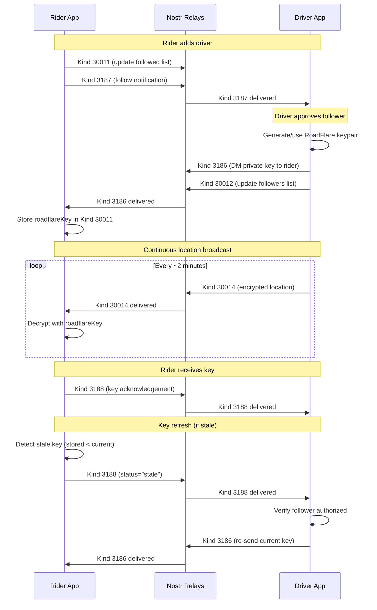
```mermaid
sequenceDiagram
    participant R as Rider App
    participant N as Nostr Relays
    participant D as Driver App

    Note over R,D: Rider adds driver
    R->>N: Kind 30011 (update followed list)
    R->>N: Kind 3187 (follow notification)
    N->>D: Kind 3187 delivered

    Note over D: Driver approves follower
    D->>D: Generate/use RoadFlare keypair
    D->>N: Kind 3186 (DM private key to rider)
    D->>N: Kind 30012 (update followers list)

    N->>R: Kind 3186 delivered
    R->>R: Store roadflareKey in Kind 30011

    Note over R,D: Continuous location broadcast
    loop Every ~2 minutes
        D->>N: Kind 30014 (encrypted location)
        N->>R: Kind 30014 delivered
        R->>R: Decrypt with roadflareKey
    end

    Note over R,D: Rider receives key
    R->>N: Kind 3188 (key acknowledgement)
    N->>D: Kind 3188 delivered

    Note over R,D: Key refresh (if stale)
    R->>R: Detect stale key (stored < current)
    R->>N: Kind 3188 (status="stale")
    N->>D: Kind 3188 delivered
    D->>D: Verify follower authorized
    D->>N: Kind 3186 (re-send current key)
    N->>R: Kind 3186 delivered
```

### Key Rotation Flow

When a driver removes (mutes) a follower, the key is rotated to exclude them from future broadcasts:

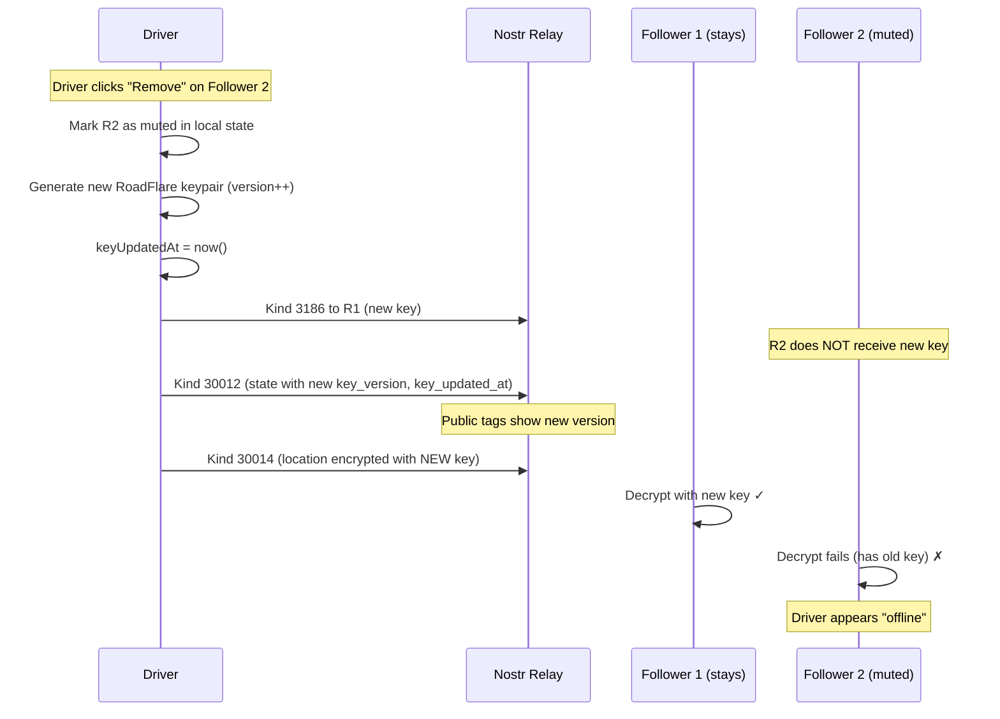
```mermaid
sequenceDiagram
    participant D as Driver
    participant N as Nostr Relay
    participant R1 as Follower 1 (stays)
    participant R2 as Follower 2 (muted)

    Note over D: Driver clicks "Remove" on Follower 2
    D->>D: Mark R2 as muted in local state
    D->>D: Generate new RoadFlare keypair (version++)
    D->>D: keyUpdatedAt = now()

    D->>N: Kind 3186 to R1 (new key)
    Note over R2: R2 does NOT receive new key

    D->>N: Kind 30012 (state with new key_version, key_updated_at)
    Note over N: Public tags show new version

    D->>N: Kind 30014 (location encrypted with NEW key)

    R1->>R1: Decrypt with new key ✓
    R2->>R2: Decrypt fails (has old key) ✗
    Note over R2: Driver appears "offline"
```

### Key Refresh Flow (January 2026)

When rider detects stale key via `checkStaleKeys()`:

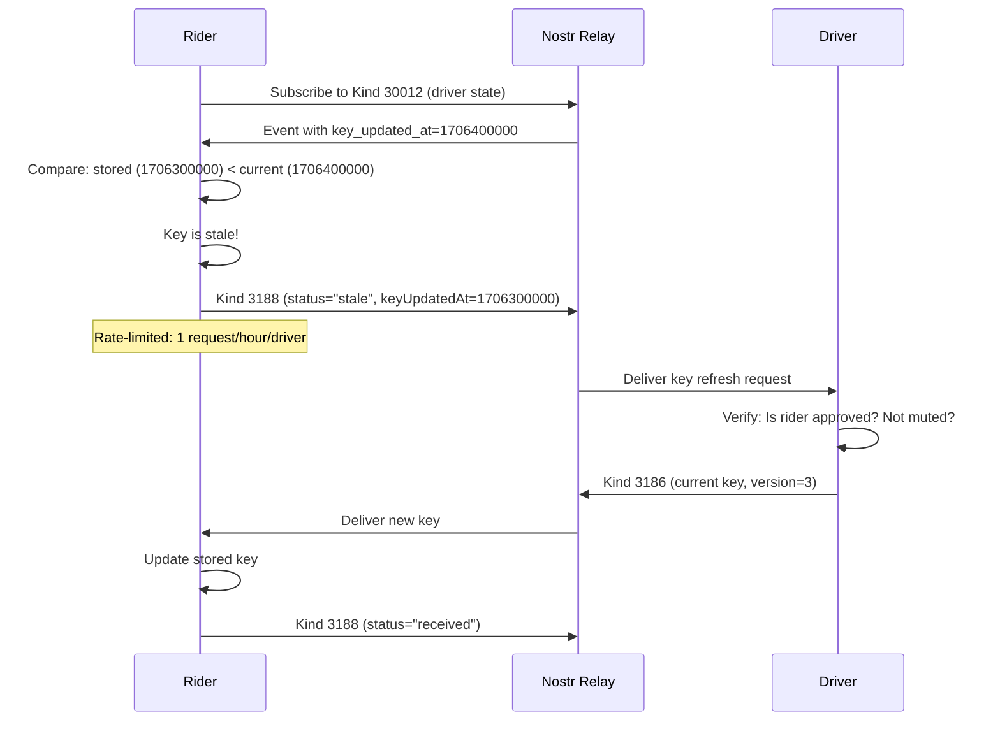
```mermaid
sequenceDiagram
    participant R as Rider
    participant N as Nostr Relay
    participant D as Driver

    R->>N: Subscribe to Kind 30012 (driver state)
    N->>R: Event with key_updated_at=1706400000
    R->>R: Compare: stored (1706300000) < current (1706400000)
    R->>R: Key is stale!

    R->>N: Kind 3188 (status="stale", keyUpdatedAt=1706300000)
    Note over R: Rate-limited: 1 request/hour/driver
    N->>D: Deliver key refresh request

    D->>D: Verify: Is rider approved? Not muted?
    D->>N: Kind 3186 (current key, version=3)
    N->>R: Deliver new key
    R->>R: Update stored key
    R->>N: Kind 3188 (status="received")
```

**Detection:** Compares `storedKeyUpdatedAt` vs `currentKeyUpdatedAt` from Kind 30012 public tags.

**Handling:** Driver verifies pubkey authorship and that follower is authorized (approved + not muted).

### Out-of-Order Event Rejection

RoadFlare location events (Kind 30014) may arrive out of order due to relay propagation delays:

```kotlin
// RoadflareTab.kt - Per-driver timestamp tracking
val lastLocationCreatedAt = mutableMapOf<String, Long>()

// On receiving Kind 30014:
val eventCreatedAt = event.createdAt
val lastSeen = lastLocationCreatedAt[driverPubKey] ?: 0L
val isOutOfOrder = eventCreatedAt < lastSeen

if (!isExpired && !isOutOfOrder) {
    lastLocationCreatedAt[driverPubKey] = eventCreatedAt
    // Process location update
}
```

**Why This Matters:**
Without timestamp checking, a late "offline" event could override a newer "online" event, causing the driver to appear offline when they're actually online.

### Cross-Device RoadFlare Sync

When driver imports their Nostr key on a new device, RoadFlare state must be restored:

```kotlin
// DriverViewModel.ensureRoadflareStateSynced() - called from proceedGoOnline()
if (localState.roadflareKey == null && localState.followers.isEmpty()) {
    val remoteState = nostrService.fetchDriverRoadflareState()
    if (remoteState != null) {
        driverRoadflareRepository.restoreFromBackup(remoteState)
    }
}
```

**What Gets Synced:**
- `roadflareKey` - The keypair for location encryption
- `followers` - List of approved riders with keyVersionSent
- `muted` - List of muted riders
- `keyUpdatedAt` - For staleness detection

**Sync Trigger Points:**
1. Key import (ProfileSyncManager)
2. Going online (full mode or RoadFlare-only)
3. Manual sync from Settings

### Driver Availability States

| Mode | Kind 30173 | Kind 30014 | Offers Received |
|------|-----------|-----------|-----------------|
| **OFFLINE** | None | None | None |
| **ROADFLARE_ONLY** | No location (privacy) | Broadcasting | Only `roadflare`-tagged |
| **AVAILABLE** | Has location + geohash | Broadcasting | All offers |
| **ON_RIDE** | Stopped (NIP-09 deleted) | `ON_RIDE` status | None |

**Key insight:** Kind 30014 (RoadFlare location) **never stops** while driver is online - only the status changes:
`ONLINE` → `ON_RIDE` → `OFFLINE`

### Follower Lifecycle State Machine

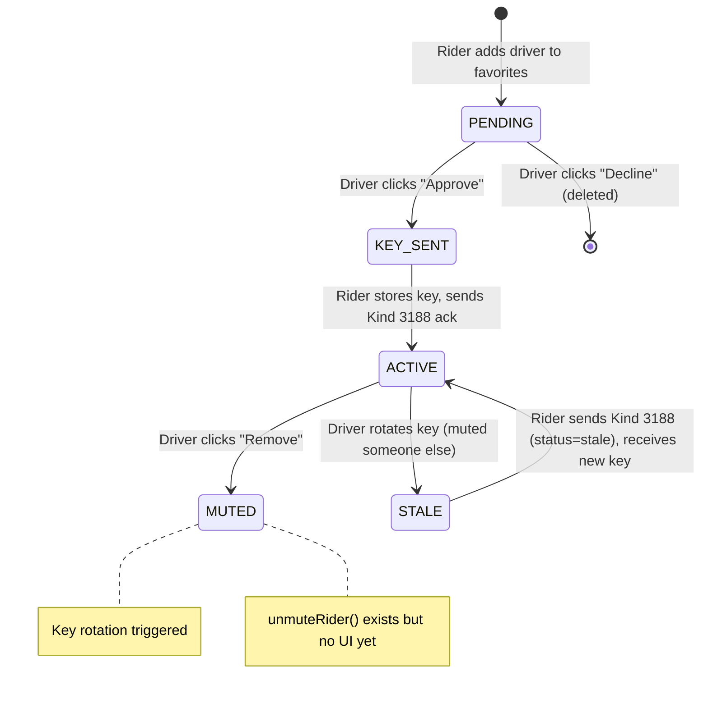
```mermaid
stateDiagram-v2
    [*] --> PENDING: Rider adds driver to favorites

    PENDING --> KEY_SENT: Driver clicks "Approve"
    PENDING --> [*]: Driver clicks "Decline" (deleted)

    KEY_SENT --> ACTIVE: Rider stores key, sends Kind 3188 ack

    ACTIVE --> MUTED: Driver clicks "Remove"
    Note right of MUTED: Key rotation triggered
    Note right of MUTED: unmuteRider() exists but no UI yet

    ACTIVE --> STALE: Driver rotates key (muted someone else)
    STALE --> ACTIVE: Rider sends Kind 3188 (status=stale), receives new key
```

**Note:** The `MUTED → PENDING` restore path exists in code (`unmuteRider()`) but the Settings UI is not yet implemented.

### Follower Actions by App

| Action | App | What Actually Happens |
|--------|-----|----------------------|
| **"Approve" follower** | Driver | Sends Kind 3186 (key share), marks `approved=true` |
| **"Decline" follower** | Driver | Deletes from `followers[]` (clean removal, no restore) |
| **"Remove" follower** | Driver | **Mutes internally** → adds to `muted[]` → rotates key |
| **"Remove" driver** | Rider | **Actually deletes** from favorites → Kind 30011 update |
| **Re-add driver** | Rider | Fresh pending state (driver must re-approve, no memory) |

**Key insight:** Driver "Remove" is mute (preserves data), Rider "Remove" is actual delete.

**Note:** `DriverRoadflareRepository.unmuteRider()` exists but UI for restoring muted followers is not yet implemented.

### Mute Notification

When a driver mutes a rider, **no notification is sent**. The rider:
1. Continues to have the old key in local storage
2. Cannot decrypt new location broadcasts (encrypted with rotated key)
3. Sees driver as "offline" or with no location data (silent degradation)

### Key Files and Methods

| Operation | File | Method |
|-----------|------|--------|
| Add follower | `RoadflareKeyManager.kt` | `handleNewFollower()` |
| Approve follower | `RoadflareKeyManager.kt` | `approveFollower()` |
| Remove follower (mutes + rotates key) | `RoadflareKeyManager.kt` | `handleMuteFollower()` |
| Send key | `RoadflareKeyManager.kt` | `sendKeyToFollower()` |
| Rotate key | `RoadflareKeyManager.kt` | `rotateKey()` |
| Unmute/restore follower | `DriverRoadflareRepository.kt` | `unmuteRider()` |
| Broadcast location | `NostrService.kt` | `publishRoadflareLocation()` |
| Subscribe to locations | `NostrService.kt` | `subscribeToRoadflareLocations()` |
| Query followers | `NostrService.kt` | `queryRoadflareFollowers()` |
| Publish key share | `NostrService.kt` | `publishRoadflareKeyShare()` |
| Subscribe to key shares | `NostrService.kt` | `subscribeToRoadflareKeyShares()` |
| Publish key ack | `NostrService.kt` | `publishRoadflareKeyAck()` |
| Subscribe to key acks | `NostrService.kt` | `subscribeToRoadflareKeyAcks()` |
| Fetch driver key timestamp | `NostrService.kt` | `fetchDriverKeyUpdatedAt()` |
| Send follow notification | `NostrService.kt` | `publishRoadflareFollowNotify()` |
| Subscribe to key acks | `NostrService.kt` | `subscribeToRoadflareKeyAcks()` |
| Ensure state synced | `DriverViewModel.kt` | `ensureRoadflareStateSynced()` |
| Check stale keys | `RoadflareTab.kt` | `checkStaleKeys()` |
| Handle key refresh | `MainActivity.kt (driver)` | Key ack handler (status="stale") |
