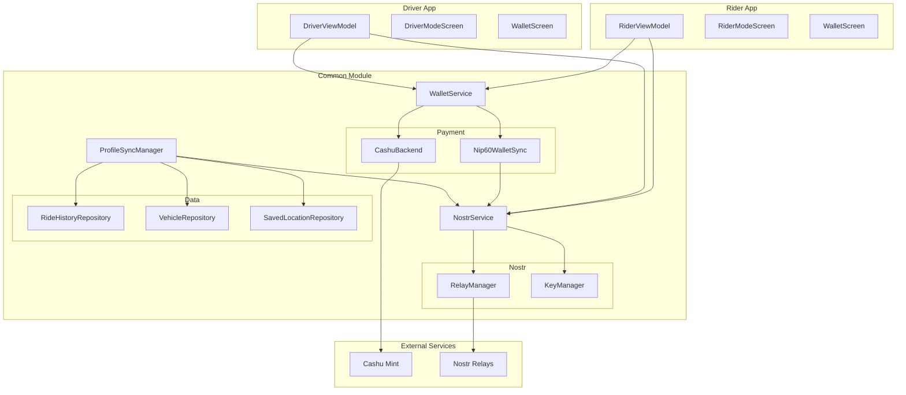
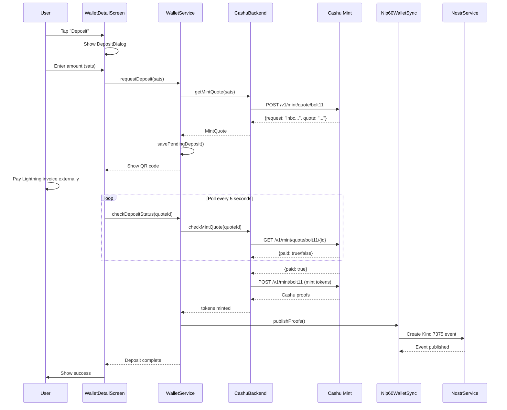
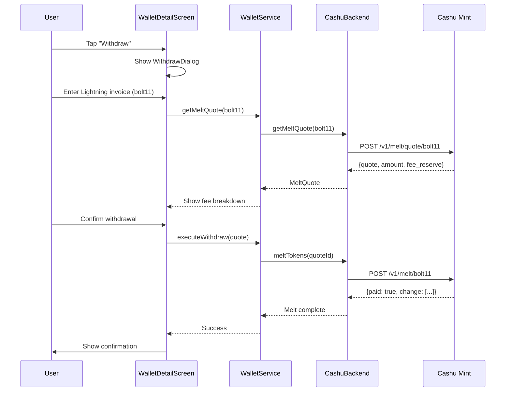
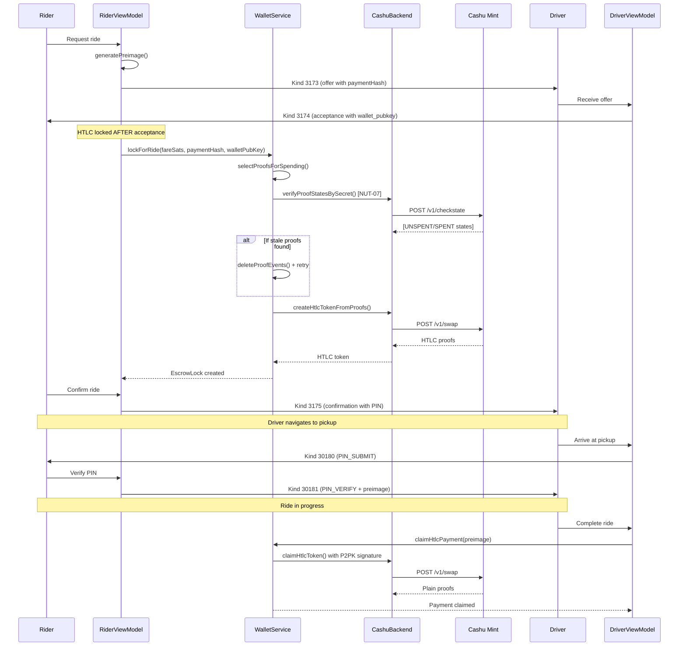
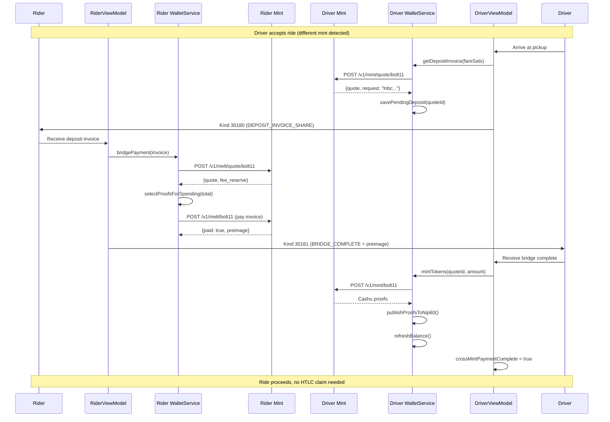
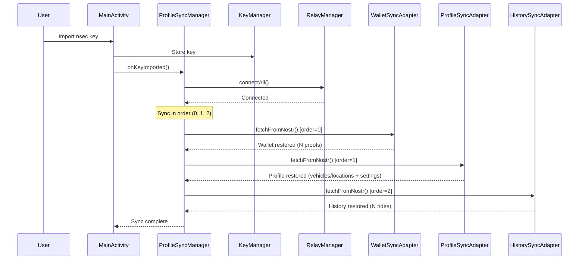

# Ridestr Module Connections

**Last Updated**: 2026-01-22

This document provides a comprehensive view of how all modules connect in the Ridestr codebase. Use this as a reference when making changes to understand what might be affected.

---

## High-Level Architecture



---

## Deposit Flow (Working)



---

## Withdraw Flow (Working)



---

## Ride Payment Flow (HTLC Escrow)



---

## Cross-Mint Bridge Payment Flow (Multi-Mint)

When rider and driver use different Cashu mints, payment happens via Lightning bridge:



**Key Points:**
- `shareDepositInvoice()` saves quote to `WalletStorage` for recovery
- `handleBridgeComplete()` calls `mintTokens()` to claim proofs
- `crossMintPaymentComplete` flag prevents MISSING_ESCROW_TOKEN error at dropoff
- Unclaimed deposits persist in local storage until claimed or manually cleared
- Developer Options → "Claim Unclaimed Deposits" for manual recovery

---

## Profile Sync Flow (Key Import)



---

## Cross-Module Dependencies

### Payment System

```
Payment System
├── WalletService (orchestration layer)
│   ├── Depends on: CashuBackend (mint operations)
│   ├── Depends on: WalletStorage (local persistence, pending ops)
│   ├── Depends on: Nip60WalletSync (cross-device sync)
│   ├── Depends on: WalletKeyManager (wallet identity)
│   ├── Key method: syncWallet() - THE sync function (NIP-60 is source of truth)
│   ├── Key method: recoverPendingOperations() - recover blinded ops on connect
│   ├── CRITICAL: Safe deletion pattern - always republish remaining proofs before deleteProofEvents()
│   ├── CRITICAL: pendingOpId must be cleared AFTER NIP-60 publish (or RecoveryToken fallback)
│   └── Used by: RiderViewModel, DriverViewModel, WalletDetailScreen, WalletSettingsScreen
│
├── CashuBackend (NUT-04/05/14 implementation)
│   ├── Depends on: cdk-kotlin library
│   ├── Depends on: WalletStorage (pending blinded operations)
│   ├── Connects to: Cashu Mint (HTTP REST)
│   ├── CRITICAL: All blinded ops save premints BEFORE request, return pendingOpId
│   ├── Caller clears pendingOpId after persisting proofs (NIP-60 or RecoveryToken)
│   └── Used by: WalletService
│
├── Nip60WalletSync (NIP-60 wallet backup - FULLY COMPLIANT)
│   ├── Depends on: NostrService (event publishing)
│   ├── Depends on: KeyManager (signing)
│   ├── Depends on: WalletKeyManager (wallet key backup)
│   ├── Kind 7375: {"mint":"...","proofs":[...]} - NIP-60 standard
│   ├── Kind 17375: [["privkey","..."],["mint","..."]] - NIP-60 standard
│   ├── IMPORTANT: One Kind 7375 event can contain MANY proofs (same eventId)
│   └── Used by: WalletService, Nip60WalletSyncAdapter
│
└── PaymentCrypto (preimage/hash utilities)
    └── Used by: RiderViewModel (escrow creation)
```

### Nostr Layer

```
Nostr Layer
├── NostrService (central event hub)
│   ├── Depends on: RelayManager (WebSocket connections)
│   ├── Depends on: KeyManager (event signing)
│   ├── Used by: RiderViewModel, DriverViewModel
│   ├── Used by: All SyncAdapters
│   └── Used by: Nip60WalletSync
│
├── RelayManager (connection pool)
│   ├── Connects to: Nostr Relays (WebSocket)
│   ├── Used by: NostrService
│   └── Used by: ProfileSyncManager
│
├── KeyManager (Nostr identity)
│   ├── Depends on: SecureKeyStorage
│   ├── Used by: NostrService
│   ├── Used by: ProfileSyncManager (shared singleton)
│   └── Used by: Nip60WalletSync
│
└── Event Models (events/*.kt)
    ├── 8 ride protocol events (Kind 30173, 3173, 3174, 3175, 30180, 30181, 3178, 3179)
    ├── 2 backup events (Kind 30174 history, 30177 profile)
    └── Used by: NostrService methods
```

### Profile Sync

```
Profile Sync
├── ProfileSyncManager (orchestrator singleton)
│   ├── Depends on: KeyManager (shared)
│   ├── Depends on: RelayManager (shared)
│   ├── Manages: All registered SyncAdapters
│   ├── Used by: MainActivity (both apps)
│   └── backupProfileData() - called by auto-backup observers
│
├── Nip60WalletSyncAdapter (order=0)
│   ├── Depends on: Nip60WalletSync
│   └── Restores: Cashu proofs (Kind 7375)
│
├── ProfileSyncAdapter (order=1) ★ UNIFIED
│   ├── Depends on: VehicleRepository (driver)
│   ├── Depends on: SavedLocationRepository (rider)
│   ├── Depends on: SettingsManager (settings sync)
│   ├── Depends on: NostrService
│   └── Restores: Kind 30177 (vehicles + locations + settings)
│
└── RideHistorySyncAdapter (order=2)
    ├── Depends on: RideHistoryRepository
    ├── Depends on: NostrService
    └── Restores: Ride history (Kind 30174)

Auto-Backup Flow (MainActivity observers):
├── Driver: vehicleRepository.vehicles → backupProfileData()
├── Rider: savedLocationRepo.savedLocations → backupProfileData()
└── Both: settingsManager.syncableSettingsHash → backupProfileData()
    └── syncableSettingsHash combines: displayCurrency, distanceUnit,
        notificationSettings, autoOpenNavigation, alwaysAskVehicle,
        paymentMethods, defaultPaymentMethod, mintUrl, customRelays
```

### State Machines

```
State Machines
├── RiderViewModel
│   ├── Depends on: NostrService (event pub/sub)
│   ├── Depends on: WalletService (payment locking)
│   ├── Depends on: RideHistoryRepository (ride storage)
│   ├── Depends on: SavedLocationRepository (location storage)
│   ├── Publishes: Kind 3173, 3175, 30181 events
│   └── Subscribes: Kind 30173, 3174, 30180, 3179 events
│
└── DriverViewModel
    ├── Depends on: NostrService (event pub/sub)
    ├── Depends on: WalletService (payment claiming)
    ├── Depends on: RideHistoryRepository (ride storage)
    ├── Depends on: VehicleRepository (vehicle data)
    ├── Publishes: Kind 30173, 3174, 30180, 3179 events
    └── Subscribes: Kind 3173, 3175, 30181 events
```

---

## Event Kind Reference

| Kind | Name | Publisher | Subscriber | Purpose |
|------|------|-----------|------------|---------|
| 30173 | Driver Availability | Driver | Rider | Driver broadcasts location/status + mint_url/payment_methods |
| 3173 | Ride Offer | Rider | Driver | Rider requests ride + mint_url/payment_method (encrypted) |
| 3174 | Ride Acceptance | Driver | Rider | Driver accepts + mint_url/payment_method |
| 3175 | Ride Confirmation | Rider | Driver | Rider confirms with PIN |
| 30180 | Driver Ride State | Driver | Rider | Status updates, PIN submission |
| 30181 | Rider Ride State | Rider | Driver | Location reveal, PIN verify, preimage |
| 3178 | Chat | Both | Both | In-ride messaging (encrypted) |
| 3179 | Cancellation | Both | Both | Ride cancellation |
| 30174 | Ride History | Self | Self | Backup (encrypted to self) |
| 30177 | Unified Profile | Self | Self | Vehicles, locations, settings + payment prefs |
| 7375 | Wallet Proofs | Self | Self | NIP-60 wallet proofs (encrypted) |
| 17375 | Wallet Metadata | Self | Self | NIP-60 wallet metadata (encrypted) |

### NIP-60 Wallet Event Formats (January 2026 - Fully Compliant)

**Kind 7375 - Proof Events** (JSON object):
```json
{"mint": "https://mint.example.com", "proofs": [{"id":"...","amount":1,"secret":"...","C":"..."}]}
```

**Kind 17375 - Wallet Metadata** (Array of tag-like pairs):
```json
[["privkey", "hex_wallet_key"], ["mint", "https://mint.example.com"], ["mnemonic", "word1 word2..."]]
```

Both are NIP-44 encrypted to user's pubkey. The `mnemonic` field is a custom extension for cdk-kotlin recovery.

### Multi-Mint Support (Issue #13 - Phase 1)

Protocol events now include payment method fields for multi-mint compatibility:

```
PaymentMethod enum (RideshareEventKinds.kt)
├── CASHU - Cashu ecash (NUT-14 HTLC)
├── LIGHTNING - Lightning Network direct
└── FIAT_CASH - Cash on delivery

Fields added to events:
├── Kind 30173 (Availability): mint_url, payment_methods[]
├── Kind 3173 (Offer): mint_url, payment_method
├── Kind 3174 (Acceptance): mint_url, payment_method
└── Kind 30177 (Profile): settings.paymentMethods[], settings.defaultPaymentMethod, settings.mintUrl
```

---

## Critical Connection Points

### Must Call Together

| Operation | Required Calls | Why |
|-----------|----------------|-----|
| Accept ride (driver) | `clearDriverStateHistory()` + `acceptOffer()` | Prevents phantom cancellation |
| Start new ride (rider) | `clearRiderStateHistory()` before new ride | Prevents history pollution |
| Login/Key import | `keyManager.refreshFromStorage()` on both NostrService AND ProfileSyncManager | Ensures shared key state |
| Wallet connection | `walletService.setNip60Sync()` after creating Nip60WalletSync | Enables cross-device sync |

### Cannot Be Removed Without Breaking

| Component | Used By | Impact if Removed |
|-----------|---------|-------------------|
| `KeyManager` (singleton) | NostrService, ProfileSyncManager, Nip60WalletSync | All signing/encryption breaks |
| `RelayManager` | NostrService, ProfileSyncManager | All Nostr communication breaks |
| `WalletService.balance` | WalletScreen (both apps), RiderViewModel | Balance display + ride checks break |
| `RideHistoryRepository` | Both ViewModels, HistorySyncAdapter | History tracking breaks |

---

## File Path Quick Reference

| Component | Path |
|-----------|------|
| **Rider ViewModel** | `rider-app/src/main/java/com/ridestr/rider/viewmodels/RiderViewModel.kt` |
| **Driver ViewModel** | `drivestr/src/main/java/com/drivestr/app/viewmodels/DriverViewModel.kt` |
| **NostrService** | `common/src/main/java/com/ridestr/common/nostr/NostrService.kt` |
| **WalletService** | `common/src/main/java/com/ridestr/common/payment/WalletService.kt` |
| **CashuBackend** | `common/src/main/java/com/ridestr/common/payment/cashu/CashuBackend.kt` |
| **ProfileSyncManager** | `common/src/main/java/com/ridestr/common/sync/ProfileSyncManager.kt` |
| **KeyManager** | `common/src/main/java/com/ridestr/common/nostr/keys/KeyManager.kt` |
| **RelayManager** | `common/src/main/java/com/ridestr/common/nostr/relay/RelayManager.kt` |
| **WalletDetailScreen** | `common/src/main/java/com/ridestr/common/ui/WalletDetailScreen.kt` |
| **WalletSettingsScreen** | `common/src/main/java/com/ridestr/common/ui/WalletSettingsScreen.kt` |
| **RideHistoryRepository** | `common/src/main/java/com/ridestr/common/data/RideHistoryRepository.kt` |
