# Ridestr Module Connections

**Last Updated**: 2026-02-12 (Ride Flow Simplification Phase 6 - Double-Confirmation Race Guard)

This document provides a comprehensive view of how all modules connect in the Ridestr codebase. Use this as a reference when making changes to understand what might be affected.

**Phase 5 Changes (February 2026):**
- NostrService split into domain services (facade pattern for backward compatibility)
- RideshareDomainService extracted (22 ride protocol methods: offers, acceptance, confirmation, state, chat, cancellation)
- CashuTokenCodec extracted from CashuBackend (stateless utilities)
- Region comments added to CashuBackend and WalletService with HTLC invariants
- Correlation ID logging for payment tracing (`[RIDE xxxxxxxx]` prefix)

**Phase 6 Changes (February 2026):**
- Payment test infrastructure: 204 unit tests with MockK + Robolectric
- FakeMintApi for queuing mock swap/checkstate responses
- CashuBackend test state injection (`setTestState()`, `testActiveKeyset`)
- `MintUnreachable` error variant for distinguishing network failures from HTTP errors

**Ride Flow Simplification Phase 4 (February 2026):**
- SubscriptionManager extracted to `common/nostr/` — centralized subscription ID lifecycle
- Replaces 10+ scattered nullable subscription ID variables in each ViewModel
- SubKeys constants for type safety, auto-close on replace, group subscriptions
- 23 unit tests in SubscriptionManagerTest.kt
- Bug fix: `proceedGoOnline()` re-establishes DELETION watcher for pending items surviving offline→online

**Ride Flow Simplification Phase 5 (February 2026):**
- Unified `acceptRide()` in DriverViewModel replaces duplicate `acceptOffer()` / `acceptBroadcastRequest()` flows

**Ride Flow Simplification Phase 6 (February 2026):**
- AtomicBoolean CAS guards prevent double-confirmation from concurrent multi-relay callbacks
- `confirmationInFlight` guards `autoConfirmRide()` and `confirmRide()` (exactly one wins per ride)
- `hasAcceptedDriver` converted to AtomicBoolean with `compareAndSet` for broadcast first-wins
- Callback stage checks use `StateFlow.update {}` CAS with `shouldConfirm` re-derived at lambda top
- Post-suspension guards check acceptance identity before stage (prevents cross-ride contamination)
- try/catch with `CancellationException` rethrow wraps confirmation coroutines

---

## High-Level Architecture


---

## Deposit Flow (Working)


---

## Withdraw Flow (Working)


---

## Ride Payment Flow (HTLC Escrow)


---

## Offer Types Comparison

Ridestr supports three ways to request a ride, each with different privacy and discovery characteristics:

### Comparison Table

| Aspect | Direct Offer | Broadcast Offer | RoadFlare Offer |
|--------|--------------|-----------------|-----------------|
| **Kind 3173 Content** | NIP-44 encrypted | Plaintext (~1km approx) | NIP-44 encrypted |
| **Target** | Specific driver (p-tag) | All drivers in area (g-tags) | Specific driver (p-tag + roadflare tag) |
| **Driver Discovery** | Kind 30173 availability | Kind 30173 + geohash filter | Kind 30014 encrypted location |
| **Privacy** | High | Medium (approximate location public) | High |
| **Recommended** | ✅ Primary method | ⚠️ Advanced/Discouraged | ✅ Primary for trusted network |
| **Pre-requisites** | Driver broadcasting availability | Route calculated | Follower approved + key received |

### Direct Offer Flow (Primary)

Rider selects a specific driver from the map and sends an encrypted offer directly to them.

```mermaid
sequenceDiagram
    participant R as Rider
    participant N as Nostr Relay
    participant D as Driver

    R->>N: Subscribe to Kind 30173 (driver availability)
    D->>N: Publish Kind 30173 (location, status, payment_methods)
    N->>R: Driver appears on map

    R->>R: Select driver, generate preimage
    R->>N: Kind 3173 (NIP-44 encrypted to driver)
    Note over N: Tags: e=availability_id, p=driver_pubkey
    N->>D: Kind 3173 delivered
    D->>D: Decrypt offer with private key

    D->>N: Kind 3174 (acceptance + wallet_pubkey)
    N->>R: Kind 3174 delivered

    R->>R: lockForRide(walletPubKey) → HTLC
    R->>N: Kind 3175 (confirmation + paymentHash + escrowToken)
    N->>D: Kind 3175 delivered

    Note over R,D: Standard ride flow continues...
```



### Broadcast Offer Flow (Advanced/Discouraged)

Rider posts a public ride request visible to all drivers in the pickup area. First driver to accept wins.

**Privacy Warning:** This broadcasts approximate location (~1km) publicly to all Nostr users. UI shows privacy warning dialog before allowing broadcast.


**Location Privacy:**
- Uses `location.approximate()` which rounds to ~1km precision (2 decimal places)
- Precise pickup only revealed to accepted driver in Kind 3175
- Progressive reveal: precise location shared when driver is within 1 mile

### RoadFlare Offer Flow (Trusted Network)

Rider is an approved follower of the driver and can see their encrypted real-time location.


**RoadFlare Benefits:**
- Encrypted location (only followers can see)
- Priority treatment (RoadFlare offers sorted first)
- Alternate payment methods supported (Zelle, PayPal, etc.)

### Key Implementation Files

| Offer Type | RiderViewModel Method | NostrService Method | RideOfferEvent Method |
|------------|----------------------|---------------------|----------------------|
| Direct | `sendRideOffer()` | `sendRideOffer()` | `create()` |
| Broadcast | `broadcastRideRequest()` | `broadcastRideRequest()` | `createBroadcast()` |
| RoadFlare | `sendRoadflareOffer()` | `sendRideOffer()` | `create()` (isRoadflare=true) |

---

## Cross-Mint Bridge Payment Flow (Multi-Mint)

When rider and driver use different Cashu mints, payment happens via Lightning bridge:


**Key Points:**
- `shareDepositInvoice()` saves quote to `WalletStorage` for recovery
- `handleBridgeComplete()` calls `mintTokens()` to claim proofs
- `crossMintPaymentComplete` flag prevents MISSING_ESCROW_TOKEN error at dropoff
- Unclaimed deposits persist in local storage until claimed or manually cleared
- Developer Options → "Claim Unclaimed Deposits" for manual recovery

---

## Profile Sync Flow (Key Import)


---

## Cross-Module Dependencies

### Payment System

```
Payment System (Phase 5 Reorganization)
├── WalletService (orchestration layer - with region comments)
│   ├── Depends on: CashuBackend (mint operations)
│   ├── Depends on: WalletStorage (local persistence, pending ops)
│   ├── Depends on: Nip60WalletSync (cross-device sync)
│   ├── Depends on: WalletKeyManager (wallet identity)
│   ├── Regions: INSTANCE STATE, LIFECYCLE, BALANCE & SYNC, HTLC PAYMENT FLOWS (with invariants),
│   │           DEPOSITS, WITHDRAWALS, CROSS-MINT BRIDGE, NIP-60 SYNC, DIAGNOSTICS, RECOVERY
│   ├── Key method: syncWallet() - THE sync function (NIP-60 is source of truth)
│   ├── Key method: ensureWalletReady(amount) - pre-ride NUT-07 verification + stale proof cleanup
│   ├── Key method: recoverPendingOperations() - recover blinded ops on connect
│   ├── CRITICAL: Safe deletion pattern - always republish remaining proofs before deleteProofEvents()
│   ├── CRITICAL: pendingOpId must be cleared AFTER NIP-60 publish (or RecoveryToken fallback)
│   └── Used by: RiderViewModel, DriverViewModel, WalletDetailScreen, WalletSettingsScreen
│
├── CashuBackend (NUT-04/05/14/17 implementation - with region comments)
│   ├── Depends on: cdk-kotlin library
│   ├── Depends on: WalletStorage (pending blinded operations)
│   ├── Depends on: CashuWebSocket (NUT-17 real-time updates)
│   ├── Depends on: CashuTokenCodec (token encoding/decoding)
│   ├── Connects to: Cashu Mint (HTTP REST + WebSocket)
│   ├── Regions: INSTANCE STATE, LIFECYCLE, MINT API QUOTES (NUT-04/05), PROOF VERIFICATION (NUT-07),
│   │           HTLC ESCROW (NUT-14) with invariants, TOKEN ENCODING, MINTING, MELTING,
│   │           KEYSET MANAGEMENT, RECOVERY (NUT-09), UTILITIES
│   ├── NUT-17: waitForMeltQuoteState(), waitForMintQuoteState() - WebSocket with polling fallback
│   ├── CRITICAL: All blinded ops save premints BEFORE request, return pendingOpId
│   ├── Caller clears pendingOpId after persisting proofs (NIP-60 or RecoveryToken)
│   └── Used by: WalletService
│
├── CashuTokenCodec (~200 lines, stateless utilities)
│   ├── Extracted from CashuBackend for better organization
│   ├── HtlcProof data class (amount, id, secret, C)
│   ├── Token encoding: encodeHtlcProofsAsToken(), encodeProofsAsToken()
│   ├── Token decoding: parseHtlcToken()
│   ├── HTLC secret parsing: extractPaymentHashFromSecret(), extractLocktimeFromSecret(), extractRefundKeysFromSecret()
│   └── Used by: CashuBackend
│
├── Nip60Store Interface (Phase 6 - Testable Abstraction)
│   ├── Interface for NIP-60 operations (enables dependency injection)
│   ├── Methods: publishProofs(), fetchProofs(), selectProofsForSpending()
│   ├── Methods: deleteProofEvents(), publishWalletMetadata()
│   ├── Methods: getBalance(), hasExistingWallet(), restoreFromNostr()
│   ├── Implementation: Nip60WalletSync
│   └── Test Double: FakeNip60Store (in test sources)
│
├── Test Infrastructure (Phase 6 + Phase 4 - 204 tests)
│   ├── FakeMintApi - Queue mock responses for swap/checkstate
│   │   ├── queueSwapSuccess(), queueSwapHttpError(), queueSwapTransportFailure()
│   │   └── queueCheckstateSuccess(), queueCheckstateHttpError()
│   ├── FakeNip60Store - Mock NIP-60 storage with verification
│   │   ├── Implements Nip60Store interface
│   │   ├── getCallLog() - Returns ordered list of operations
│   │   └── verifyPublishBeforeDelete() - Asserts safe deletion pattern
│   ├── CashuBackend.setTestState() - Bypass HTTP for unit tests
│   │   ├── Sets currentMintUrl, testActiveKeyset, walletSeed directly
│   │   └── @VisibleForTesting annotation for safety
│   ├── MainDispatcherRule - JUnit rule for Dispatchers.Main override
│   ├── Test Files (204 tests total):
│   │   ├── PaymentCryptoTest.kt (23) - Preimage/hash generation
│   │   ├── CashuCryptoTest.kt (30) - hashToCurve, NUT-13, BIP-39
│   │   ├── CashuTokenCodecTest.kt (30) - Token encoding/decoding
│   │   ├── HtlcResultTest.kt (23) - Sealed class exhaustiveness
│   │   ├── CashuBackendErrorTest.kt (32) - Error mapping with FakeMintApi
│   │   ├── FakeNip60StoreTest.kt (32) - Mock NIP-60 API behavior
│   │   ├── ProofConservationTest.kt (10) - Proof safety invariants
│   │   └── SubscriptionManagerTest.kt (23) - Subscription lifecycle, auto-close, groups
│   └── Dependencies: MockK, Robolectric, androidx.test.core, kotlinx-coroutines-test
│
├── CashuWebSocket (NUT-17 WebSocket subscriptions)
│   ├── Depends on: OkHttp WebSocket
│   ├── Connects to: Cashu Mint (wss://mint.example.com/v1/ws)
│   ├── Subscription kinds: bolt11_mint_quote, bolt11_melt_quote, proof_state
│   ├── Auto-reconnection with exponential backoff
│   ├── Callbacks: onMintQuoteUpdate, onMeltQuoteUpdate, onProofStateUpdate
│   └── Used by: CashuBackend
│
├── Nip60WalletSync (NIP-60 wallet backup - FULLY COMPLIANT + Cross-App Safe)
│   ├── Depends on: NostrService (event publishing)
│   ├── Depends on: KeyManager (signing)
│   ├── Depends on: WalletKeyManager (wallet key backup)
│   ├── Kind 7375: {"mint":"...","proofs":[...]} - NIP-60 standard
│   ├── Kind 17375: [["privkey","..."],["mint","..."]] - NIP-60 standard
│   ├── IMPORTANT: One Kind 7375 event can contain MANY proofs (same eventId)
│   ├── SAFETY: getExistingWalletMetadata() - check before overwriting other app's data
│   ├── SAFETY: publishWalletMetadata(forceOverwrite) - explicit param for overwrites
│   └── Used by: WalletService, Nip60WalletSyncAdapter
│
└── PaymentCrypto (preimage/hash utilities)
    └── Used by: RiderViewModel (escrow creation)
```

### Nostr Layer

```
Nostr Layer (Phase 5 Domain Decomposition)
├── NostrService (facade - delegates to domain services)
│   ├── Depends on: RelayManager (WebSocket connections)
│   ├── Depends on: KeyManager (event signing)
│   ├── Depends on: NostrCryptoHelper (encryption)
│   ├── Depends on: ProfileBackupService (profile/history backup)
│   ├── Depends on: RoadflareDomainService (RoadFlare events)
│   ├── Depends on: RideshareDomainService (ride protocol events)
│   ├── Used by: RiderViewModel, DriverViewModel
│   ├── Used by: All SyncAdapters
│   └── Used by: Nip60WalletSync
│   Note: Facade keeps all existing method signatures for backward compatibility
│
├── NostrCryptoHelper (~150 lines)
│   ├── Depends on: KeyManager (signing)
│   ├── Methods: encryptForUser(), decryptFromUser()
│   ├── Methods: encryptLocationForRiderState(), decryptLocationFromRiderState()
│   ├── Methods: encryptPinForDriverState(), decryptPinFromDriverState()
│   └── Used by: NostrService (delegation)
│
├── ProfileBackupService (~500 lines)
│   ├── Depends on: RelayManager, KeyManager
│   ├── State: userDisplayName StateFlow
│   ├── Profile: publishProfile(), subscribeToProfile(), subscribeToOwnProfile()
│   ├── History: publishRideHistoryBackup(), fetchRideHistory(), deleteRideHistoryBackup()
│   ├── Unified: publishProfileBackup(), fetchProfileBackup() (Kind 30177)
│   ├── Legacy: backupVehicles(), backupSavedLocations() (Kind 30175/30176)
│   └── Used by: NostrService (delegation)
│
├── RoadflareDomainService (~600 lines)
│   ├── Depends on: RelayManager, KeyManager, NostrCryptoHelper
│   ├── Followed: publishFollowedDrivers(), fetchFollowedDrivers() (Kind 30011)
│   ├── State: publishDriverRoadflareState(), fetchDriverRoadflareState() (Kind 30012)
│   ├── Location: publishRoadflareLocation(), subscribeToRoadflareLocations() (Kind 30014)
│   ├── Keys: publishRoadflareKeyShare(), subscribeToRoadflareKeyShares() (Kind 3186)
│   ├── Ack: publishRoadflareKeyAck(), subscribeToRoadflareKeyAcks() (Kind 3188)
│   └── Used by: NostrService (delegation)
│
├── RideshareDomainService (~900 lines)
│   ├── Depends on: RelayManager, KeyManager
│   ├── Availability: broadcastAvailability(), subscribeToDrivers(), subscribeToDriverAvailability() (Kind 30173)
│   ├── Offers: sendRideOffer(), broadcastRideRequest(), subscribeToBroadcastRideRequests(), subscribeToOffers() (Kind 3173)
│   ├── Acceptance: acceptRide(), acceptBroadcastRide(), subscribeToAcceptance(), subscribeToAcceptancesForOffer() (Kind 3174)
│   ├── Confirmation: confirmRide(), subscribeToConfirmation() (Kind 3175)
│   ├── DriverState: publishDriverRideState(), subscribeToDriverRideState() (Kind 30180)
│   ├── RiderState: publishRiderRideState(), subscribeToRiderRideState() (Kind 30181)
│   ├── Chat: sendChatMessage(), subscribeToChatMessages() (Kind 3178)
│   ├── Cancel: publishRideCancellation(), subscribeToCancellation() (Kind 3179)
│   ├── Deletions: subscribeToRideRequestDeletions() (Kind 5)
│   └── Used by: NostrService (delegation)
│
├── SubscriptionManager (Phase 4 - subscription lifecycle)
│   ├── Depends on: NostrService.closeSubscription() (callback)
│   ├── Singular: set(), get(), close(), closeAll(vararg keys)
│   ├── Groups: setInGroup(), closeInGroup(), closeGroup(), groupContains()
│   ├── Thread-safe: synchronized lock, relay I/O outside lock
│   ├── Auto-closes old subscription when setting new one for same key
│   └── Used by: RiderViewModel (SubKeys: DRIVERS, ACCEPTANCE, CHAT, etc.), DriverViewModel (SubKeys: OFFERS, DELETION, etc.)
│
├── RelayManager (connection pool)
│   ├── Connects to: Nostr Relays (WebSocket)
│   ├── Used by: NostrService and all domain services
│   └── Used by: ProfileSyncManager
│
├── KeyManager (Nostr identity)
│   ├── Depends on: SecureKeyStorage
│   ├── Used by: NostrService and all domain services
│   ├── Used by: ProfileSyncManager (shared singleton)
│   └── Used by: Nip60WalletSync
│
└── Event Models (events/*.kt)
    ├── 8 ride protocol events (Kind 30173, 3173, 3174, 3175, 30180, 30181, 3178, 3179)
    ├── 2 backup events (Kind 30174 history, 30177 profile)
    └── Used by: NostrService methods
```

### Profile Sync

```
Profile Sync
├── ProfileSyncManager (orchestrator singleton)
│   ├── Depends on: KeyManager (shared)
│   ├── Depends on: RelayManager (shared)
│   ├── Manages: All registered SyncAdapters
│   ├── Used by: MainActivity (both apps)
│   └── backupProfileData() - called by auto-backup observers
│
├── Nip60WalletSyncAdapter (order=0)
│   ├── Depends on: Nip60WalletSync
│   └── Restores: Cashu proofs (Kind 7375)
│
├── ProfileSyncAdapter (order=1) ★ UNIFIED
│   ├── Depends on: VehicleRepository (driver)
│   ├── Depends on: SavedLocationRepository (rider)
│   ├── Depends on: SettingsManager (settings sync)
│   ├── Depends on: NostrService
│   └── Restores: Kind 30177 (vehicles + locations + settings)
│
└── RideHistorySyncAdapter (order=2)
    ├── Depends on: RideHistoryRepository
    ├── Depends on: NostrService
    └── Restores: Ride history (Kind 30174)

Auto-Backup Flow (MainActivity observers):
├── Driver: vehicleRepository.vehicles → backupProfileData()
├── Rider: savedLocationRepo.savedLocations → backupProfileData()
└── Both: settingsManager.syncableSettingsHash → backupProfileData()
    └── syncableSettingsHash combines: displayCurrency, distanceUnit,
        notificationSettings, autoOpenNavigation, alwaysAskVehicle,
        paymentMethods, defaultPaymentMethod, mintUrl, customRelays,
        roadflarePaymentMethods
```

### State Machines

```
State Machines
├── RiderViewModel
│   ├── Depends on: NostrService (event pub/sub)
│   ├── Depends on: WalletService (payment locking)
│   ├── Depends on: RideHistoryRepository (ride storage)
│   ├── Depends on: SavedLocationRepository (location storage)
│   ├── Publishes: Kind 3173, 3175, 30181 events
│   └── Subscribes: Kind 30173, 3174, 30180, 3179 events
│
├── RiderViewModel
│   ├── Depends on: NostrService (event pub/sub)
│   ├── Depends on: WalletService (payment locking, ensureWalletReady)
│   ├── Depends on: RideHistoryRepository (ride storage)
│   ├── Depends on: SavedLocationRepository (location storage)
│   ├── Depends on: FollowedDriversRepository (RoadFlare drivers)
│   ├── Publishes: Kind 3173, 3175, 30181 events
│   └── Subscribes: Kind 30173, 3174, 30180, 3179 events
│
└── DriverViewModel
    ├── Depends on: NostrService (event pub/sub)
    ├── Depends on: WalletService (payment claiming)
    ├── Depends on: RideHistoryRepository (ride storage)
    ├── Depends on: VehicleRepository (vehicle data)
    ├── Depends on: RoadflareLocationBroadcaster (location broadcast lifecycle)
    ├── Depends on: DriverRoadflareRepository (follower/key state)
    ├── Publishes: Kind 30173, 3174, 30180, 3179, 30014 events
    └── Subscribes: Kind 3173, 3175, 30181 events
```

---

## Event Kind Reference

| Kind | Name | Publisher | Subscriber | Purpose |
|------|------|-----------|------------|---------|
| 30173 | Driver Availability | Driver | Rider | Driver broadcasts location/status + mint_url/payment_methods |
| 3173 | Ride Offer | Rider | Driver | Rider requests ride + mint_url/payment_method (encrypted) |
| 3174 | Ride Acceptance | Driver | Rider | Driver accepts + mint_url/payment_method |
| 3175 | Ride Confirmation | Rider | Driver | Rider confirms with PIN |
| 30180 | Driver Ride State | Driver | Rider | Status updates, PIN submission |
| 30181 | Rider Ride State | Rider | Driver | Location reveal, PIN verify, preimage |
| 3178 | Chat | Both | Both | In-ride messaging (encrypted) |
| 3179 | Cancellation | Both | Both | Ride cancellation |
| 30174 | Ride History | Self | Self | Backup (encrypted to self) |
| 30177 | Unified Profile | Self | Self | Vehicles, locations, settings + payment prefs |
| 30182 | Admin Config | Admin | All Apps | Platform config (fare rates, recommended mints) |
| 7375 | Wallet Proofs | Self | Self | NIP-60 wallet proofs (encrypted) |
| 17375 | Wallet Metadata | Self | Self | NIP-60 wallet metadata (encrypted) |
| **30011** | Followed Drivers | Rider | Rider | RoadFlare: favorite drivers + keys (to self) |
| **30012** | Driver RoadFlare State | Driver | Driver | RoadFlare: keypair, followers, muted (to self) |
| **30014** | RoadFlare Location | Driver | Rider | RoadFlare: encrypted location broadcast |
| **3186** | RoadFlare Key Share | Driver | Rider | RoadFlare: private key DM to follower |
| **3187** | Follow Notification | Rider | Driver | RoadFlare: follow notification (real-time UX) |
| **3188** | Key Acknowledgement | Rider | Driver | RoadFlare: key receipt confirmation (5-min expiry) |

### NIP-60 Wallet Event Formats (January 2026 - Fully Compliant)

**Kind 7375 - Proof Events** (JSON object):
```json
{"mint": "https://mint.example.com", "proofs": [{"id":"...","amount":1,"secret":"...","C":"..."}]}
```

**Kind 17375 - Wallet Metadata** (Array of tag-like pairs):
```json
[["privkey", "hex_wallet_key"], ["mint", "https://mint.example.com"], ["mnemonic", "word1 word2..."]]
```

Both are NIP-44 encrypted to user's pubkey. The `mnemonic` field is a custom extension for cdk-kotlin recovery.

### Multi-Mint Support (Issue #13 - Phase 1)

Protocol events now include payment method fields for multi-mint compatibility:

```
PaymentMethod enum (RideshareEventKinds.kt)
├── CASHU - Cashu ecash (NUT-14 HTLC)
├── LIGHTNING - Lightning Network direct
├── FIAT_CASH - Cash on delivery
└── RoadFlare Alternate Methods:
    ├── ZELLE - Zelle
    ├── PAYPAL - PayPal
    ├── CASH_APP - Cash App
    ├── VENMO - Venmo
    ├── CASH - Cash
    └── STRIKE - Strike

Fields added to events:
├── Kind 30173 (Availability): mint_url, payment_methods[]
├── Kind 3173 (Offer): mint_url, payment_method
├── Kind 3174 (Acceptance): mint_url, payment_method
└── Kind 30177 (Profile): settings.paymentMethods[], settings.defaultPaymentMethod, settings.mintUrl
```

---

## Payment Methods

### Status Overview

| Method | Enum Value | Status | Implementation |
|--------|------------|--------|----------------|
| **Cashu HTLC** | `CASHU` | ✅ Working | NUT-14 escrow with deferred locking |
| **Lightning Direct** | `LIGHTNING` | 🚧 Planned | Driver generates invoice, rider pays |
| **Fiat Cash** | `FIAT_CASH` | 🚧 Planned | Cash on delivery, trust-based |
| **RoadFlare Alternates** | Various | ✅ Working | External apps (Zelle, PayPal, etc.) |

### Cashu HTLC Payment Flow (Current)

The payment system uses NUT-14 Hash Time-Locked Contracts with **deferred locking** - HTLC is created AFTER driver acceptance using driver's `wallet_pubkey`.


**Critical Design: Nostr Key ≠ Wallet Key**

For security isolation, identity and payment use **different keys**:
- **Nostr key**: User identity, event signing, NIP-44 encryption
- **Wallet key**: P2PK escrow claims, BIP-340 Schnorr signatures

Driver's `wallet_pubkey` in Kind 3174 ensures HTLC is locked to correct key. Without this, payment claims fail with "invalid signature".

**HTLC Preimage Storage (January 2026)**

Preimage is now stored in `PendingHtlc` for future-proof refunds:
- If driver doesn't claim before locktime, rider can refund
- `refundExpiredHtlc()` uses stored preimage if available
- Falls back to zeros for old HTLCs (mint compatibility workaround)

### RoadFlare Alternate Payment Methods

RoadFlare rides support non-HTLC payment methods for trusted relationships:

| Method | Enum | Settlement |
|--------|------|------------|
| Zelle | `ZELLE` | External app |
| PayPal | `PAYPAL` | External app |
| Cash App | `CASH_APP` | External app |
| Venmo | `VENMO` | External app |
| Cash | `CASH` | In-person |
| Strike | `STRIKE` | Lightning via Strike |

These bypass wallet balance checks and HTLC escrow entirely - payment handled outside the app.

### Payment Path Detection

When rider and driver use different mints, the system detects cross-mint scenario:

```
Payment Path Detection (WalletService)
├── SAME_MINT: riderMintUrl == driverMintUrl → HTLC escrow
├── CROSS_MINT: riderMintUrl != driverMintUrl → Lightning bridge
└── NO_ESCROW: RoadFlare alternate methods → External settlement
```

Cross-mint bridge executes at PIN verification (see Cross-Mint Bridge Payment Flow above).

---

## Security Hardening (January 2026)

### Summary

| Component | Description | Status |
|-----------|-------------|--------|
| **Backup Exclusions** | Secrets excluded from Android cloud backup | ✅ |
| **Pubkey Validation** | Event parsers verify expected pubkey | ✅ |
| **WebSocket Concurrency** | Bounded channels, generation tracking | ✅ |
| **Signature Verification** | Relay-level NIP-01 Schnorr verification | ✅ |
| **Encryption Fallback Warning** | Warns when storage falls back to plaintext | ✅ |

### Signature Verification Flow


### Event Parsers with Pubkey Validation

| Parser | Expected Pubkey | File |
|--------|-----------------|------|
| `RideAcceptanceEvent.parse()` | `expectedDriverPubKey` | `RideAcceptanceEvent.kt:25` |
| `RideConfirmationEvent.parseEncrypted()` | `expectedRiderPubKey` | `RideConfirmationEvent.kt:30` |
| `DriverRideStateEvent.parse()` | `expectedDriverPubKey` | `DriverRideStateEvent.kt` |
| `RiderRideStateEvent.parse()` | `expectedRiderPubKey` | `RiderRideStateEvent.kt` |

### Backup Exclusions

Both apps exclude sensitive SharedPreferences from Android cloud backup:

**Excluded Files** (in `backup_rules.xml`):
- `ridestr_secure_keys.xml` - Nostr private key
- `ridestr_wallet_keys.xml` - Wallet mnemonic
- `ridestr_wallet_storage.xml` - Wallet proofs, counters
- `ridestr_settings.xml` - User preferences
- `ridestr_ride_history.xml` - Ride history
- `ridestr_saved_locations.xml` - Saved locations
- `roadflare_*.xml` - RoadFlare state

**Recovery Path:** Nostr sync (Kind 30174 history, Kind 30177 profile, Kind 7375 wallet proofs)

### WebSocket Concurrency (RelayConnection.kt)

Prevents memory exhaustion and race conditions:

```kotlin
private val messageChannel = Channel<Pair<Long, String>>(capacity = 256)
private var connectionGeneration = 0L  // Increments on connect()
```

- **Bounded queue (256)**: Prevents memory exhaustion under bursty traffic
- **Generation tracking**: Prevents stale callback corruption after reconnect
- **Synchronized state**: Race condition protection for socket operations

---

## Critical Connection Points

### Must Call Together

| Operation | Required Calls | Why |
|-----------|----------------|-----|
| Accept ride (driver) | `clearDriverStateHistory()` + `acceptOffer()` | Prevents phantom cancellation |
| Start new ride (rider) | `clearRiderStateHistory()` before new ride | Prevents history pollution |
| Login/Key import | `keyManager.refreshFromStorage()` on both NostrService AND ProfileSyncManager | Ensures shared key state |
| Wallet connection | `walletService.setNip60Sync()` after creating Nip60WalletSync | Enables cross-device sync |

### Cannot Be Removed Without Breaking

| Component | Used By | Impact if Removed |
|-----------|---------|-------------------|
| `KeyManager` (singleton) | NostrService, ProfileSyncManager, Nip60WalletSync | All signing/encryption breaks |
| `RelayManager` | NostrService, ProfileSyncManager | All Nostr communication breaks |
| `WalletService.balance` | WalletScreen (both apps), RiderViewModel | Balance display + ride checks break |
| `RideHistoryRepository` | Both ViewModels, HistorySyncAdapter | History tracking breaks |

---

## File Path Quick Reference

| Component | Path |
|-----------|------|
| **Rider ViewModel** | `rider-app/src/main/java/com/ridestr/rider/viewmodels/RiderViewModel.kt` |
| **Driver ViewModel** | `drivestr/src/main/java/com/drivestr/app/viewmodels/DriverViewModel.kt` |
| **NostrService (facade)** | `common/src/main/java/com/ridestr/common/nostr/NostrService.kt` |
| **NostrCryptoHelper** | `common/src/main/java/com/ridestr/common/nostr/NostrCryptoHelper.kt` |
| **ProfileBackupService** | `common/src/main/java/com/ridestr/common/nostr/ProfileBackupService.kt` |
| **RoadflareDomainService** | `common/src/main/java/com/ridestr/common/nostr/RoadflareDomainService.kt` |
| **RideshareDomainService** | `common/src/main/java/com/ridestr/common/nostr/RideshareDomainService.kt` |
| **SubscriptionManager** | `common/src/main/java/com/ridestr/common/nostr/SubscriptionManager.kt` |
| **WalletService** | `common/src/main/java/com/ridestr/common/payment/WalletService.kt` |
| **CashuBackend** | `common/src/main/java/com/ridestr/common/payment/cashu/CashuBackend.kt` |
| **CashuTokenCodec** | `common/src/main/java/com/ridestr/common/payment/cashu/CashuTokenCodec.kt` |
| **ProfileSyncManager** | `common/src/main/java/com/ridestr/common/sync/ProfileSyncManager.kt` |
| **KeyManager** | `common/src/main/java/com/ridestr/common/nostr/keys/KeyManager.kt` |
| **RelayManager** | `common/src/main/java/com/ridestr/common/nostr/relay/RelayManager.kt` |
| **WalletDetailScreen** | `common/src/main/java/com/ridestr/common/ui/WalletDetailScreen.kt` |
| **WalletSettingsScreen** | `common/src/main/java/com/ridestr/common/ui/WalletSettingsScreen.kt` |
| **KeyBackupScreen** | `common/src/main/java/com/ridestr/common/ui/screens/KeyBackupScreen.kt` |
| **ProfileSetupContent** | `common/src/main/java/com/ridestr/common/ui/screens/ProfileSetupContent.kt` |
| **OnboardingComponents** | `common/src/main/java/com/ridestr/common/ui/screens/OnboardingComponents.kt` |
| **SettingsComponents** | `common/src/main/java/com/ridestr/common/ui/components/SettingsComponents.kt` |
| **RideHistoryRepository** | `common/src/main/java/com/ridestr/common/data/RideHistoryRepository.kt` |
| **FollowedDriversRepository** | `common/src/main/java/com/ridestr/common/data/FollowedDriversRepository.kt` |
| **DriverRoadflareRepository** | `common/src/main/java/com/ridestr/common/data/DriverRoadflareRepository.kt` |
| **RoadflareKeyManager** | `common/src/main/java/com/ridestr/common/roadflare/RoadflareKeyManager.kt` |
| **RoadflareLocationBroadcaster** | `common/src/main/java/com/ridestr/common/roadflare/RoadflareLocationBroadcaster.kt` |

---

## RoadFlare System

RoadFlare enables riders to build a **personal rideshare network** of trusted drivers. Instead of discovering drivers via public availability broadcasts (Kind 30173), riders with RoadFlare keys can see their favorite drivers' **encrypted real-time locations** (Kind 30014) and send priority requests.

### Core Concepts

| Concept | Description |
|---------|-------------|
| **RoadFlare Key** | Separate Nostr keypair (not identity key) used for location encryption |
| **Follower** | Rider who has been sent the RoadFlare private key |
| **Key Rotation** | When follower is removed, new key generated and distributed to remaining followers |
| **Staleness** | Rider detects key is outdated via `key_updated_at` tag on Kind 30012 |

### Encryption Model (Shared Keypair)

RoadFlare uses a **single keypair** for all followers - enabling efficient 1-to-N encrypted broadcasts:

```
Driver broadcasts:    nip44Encrypt(location, roadflarePubKey)
Follower decrypts:    nip44Decrypt(ciphertext, driverIdentityPubKey) using stored roadflarePrivKey

ECDH is commutative:  ECDH(driver_priv, roadflare_pub) == ECDH(roadflare_priv, driver_pub)
```

**Efficiency:** 1 encryption for N followers (vs N separate NIP-44 DMs)

### Architecture

```
RoadFlare System
├── Rider App
│   ├── RoadflareTab.kt - Favorite drivers UI, location subscription, stale key detection
│   ├── AddDriverScreen.kt - Add driver via QR/manual entry
│   └── FollowedDriversRepository.kt - Local cache of followed drivers + keys
│
├── Driver App
│   ├── RoadflareTab.kt - QR code, followers, accepted payment methods
│   ├── SettingsScreen.kt - Removed Followers list with "Restore" option
│   ├── RoadflareListenerService.kt - Foreground service for background RoadFlare ride alerts
│   ├── RoadflareLocationBroadcaster.kt - Timer-based location broadcast (~2 min)
│   └── RoadflareKeyManager.kt - Keypair lifecycle, key distribution
│
└── Common Module
    ├── FollowedDriversEvent.kt (Kind 30011)
    ├── DriverRoadflareStateEvent.kt (Kind 30012)
    ├── RoadflareLocationEvent.kt (Kind 30014)
    ├── RoadflareKeyShareEvent.kt (Kind 3186)
    ├── RoadflareFollowNotifyEvent.kt (Kind 3187) - Real-time notification
    ├── RoadflareKeyAckEvent.kt (Kind 3188)
    ├── FollowedDriversSyncAdapter.kt
    └── DriverRoadflareSyncAdapter.kt
```

### Two-Way Connection Flow


### Key Rotation Flow

When a driver removes (mutes) a follower, the key is rotated to exclude them from future broadcasts:


### Key Refresh Flow (January 2026)

When rider detects stale key via `checkStaleKeys()`:


**Detection:** Compares `storedKeyUpdatedAt` vs `currentKeyUpdatedAt` from Kind 30012 public tags.

**Handling:** Driver verifies pubkey authorship and that follower is authorized (approved + not muted).

### Out-of-Order Event Rejection

RoadFlare location events (Kind 30014) may arrive out of order due to relay propagation delays:

```kotlin
// RoadflareTab.kt - Per-driver timestamp tracking
val lastLocationCreatedAt = mutableMapOf<String, Long>()

// On receiving Kind 30014:
val eventCreatedAt = event.createdAt
val lastSeen = lastLocationCreatedAt[driverPubKey] ?: 0L
val isOutOfOrder = eventCreatedAt < lastSeen

if (!isExpired && !isOutOfOrder) {
    lastLocationCreatedAt[driverPubKey] = eventCreatedAt
    // Process location update
}
```

**Why This Matters:**
Without timestamp checking, a late "offline" event could override a newer "online" event, causing the driver to appear offline when they're actually online.

### Cross-Device RoadFlare Sync

When driver imports their Nostr key on a new device, RoadFlare state must be restored:

```kotlin
// DriverViewModel.ensureRoadflareStateSynced() - called from proceedGoOnline()
if (localState.roadflareKey == null && localState.followers.isEmpty()) {
    val remoteState = nostrService.fetchDriverRoadflareState()
    if (remoteState != null) {
        driverRoadflareRepository.restoreFromBackup(remoteState)
    }
}
```

**What Gets Synced:**
- `roadflareKey` - The keypair for location encryption
- `followers` - List of approved riders with keyVersionSent
- `muted` - List of muted riders
- `keyUpdatedAt` - For staleness detection

**Sync Trigger Points:**
1. Key import (ProfileSyncManager)
2. Going online (full mode or RoadFlare-only)
3. Manual sync from Settings

### Driver Availability States

| Mode | Kind 30173 | Kind 30014 | Offers Received |
|------|-----------|-----------|-----------------|
| **OFFLINE** | None | None | None |
| **ROADFLARE_ONLY** | No location (privacy) | Broadcasting | Only `roadflare`-tagged |
| **AVAILABLE** | Has location + geohash | Broadcasting | All offers |
| **ON_RIDE** | Stopped (NIP-09 deleted) | `ON_RIDE` status | None |

**Key insight:** Kind 30014 (RoadFlare location) **never stops** while driver is online - only the status changes:
`ONLINE` → `ON_RIDE` → `OFFLINE`

### Follower Lifecycle State Machine


**Note:** The `MUTED → PENDING` restore path exists in code (`unmuteRider()`) but the Settings UI is not yet implemented.

### Follower Actions by App

| Action | App | What Actually Happens |
|--------|-----|----------------------|
| **"Approve" follower** | Driver | Sends Kind 3186 (key share), marks `approved=true` |
| **"Decline" follower** | Driver | Deletes from `followers[]` (clean removal, no restore) |
| **"Remove" follower** | Driver | **Mutes internally** → adds to `muted[]` → rotates key |
| **"Remove" driver** | Rider | **Actually deletes** from favorites → Kind 30011 update |
| **Re-add driver** | Rider | Fresh pending state (driver must re-approve, no memory) |

**Key insight:** Driver "Remove" is mute (preserves data), Rider "Remove" is actual delete.

**Note:** `DriverRoadflareRepository.unmuteRider()` exists but UI for restoring muted followers is not yet implemented.

### Mute Notification

When a driver mutes a rider, **no notification is sent**. The rider:
1. Continues to have the old key in local storage
2. Cannot decrypt new location broadcasts (encrypted with rotated key)
3. Sees driver as "offline" or with no location data (silent degradation)

### Key Files and Methods

| Operation | File | Method |
|-----------|------|--------|
| Add follower | `RoadflareKeyManager.kt` | `handleNewFollower()` |
| Approve follower | `RoadflareKeyManager.kt` | `approveFollower()` |
| Remove follower (mutes + rotates key) | `RoadflareKeyManager.kt` | `handleMuteFollower()` |
| Send key | `RoadflareKeyManager.kt` | `sendKeyToFollower()` |
| Rotate key | `RoadflareKeyManager.kt` | `rotateKey()` |
| Unmute/restore follower | `DriverRoadflareRepository.kt` | `unmuteRider()` |
| Broadcast location | `NostrService.kt` | `publishRoadflareLocation()` |
| Subscribe to locations | `NostrService.kt` | `subscribeToRoadflareLocations()` |
| Query followers | `NostrService.kt` | `queryRoadflareFollowers()` |
| Publish key share | `NostrService.kt` | `publishRoadflareKeyShare()` |
| Subscribe to key shares | `NostrService.kt` | `subscribeToRoadflareKeyShares()` |
| Publish key ack | `NostrService.kt` | `publishRoadflareKeyAck()` |
| Subscribe to key acks | `NostrService.kt` | `subscribeToRoadflareKeyAcks()` |
| Fetch driver key timestamp | `NostrService.kt` | `fetchDriverKeyUpdatedAt()` |
| Send follow notification | `NostrService.kt` | `publishRoadflareFollowNotify()` |
| Subscribe to key acks | `NostrService.kt` | `subscribeToRoadflareKeyAcks()` |
| Ensure state synced | `DriverViewModel.kt` | `ensureRoadflareStateSynced()` |
| Check stale keys | `RoadflareTab.kt` | `checkStaleKeys()` |
| Handle key refresh | `MainActivity.kt (driver)` | Key ack handler (status="stale") |
